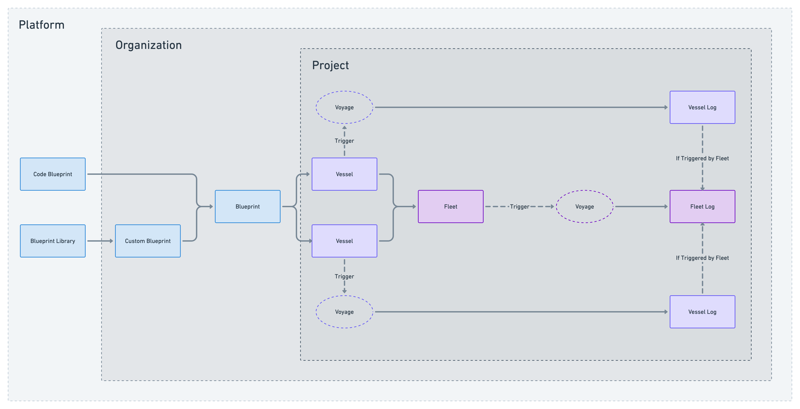

# Glossary of Terms

## What's in a name?
Our goal with Shipyard is to choose syntax that helps users intuitively understand the connections between entities by using real-world equivalents.

- A **Shipyard** is where you build and launch Vessels (ships). 
- **Vessels** come in all shapes and sizes (tugboat, sailboat, yacht, freighter, etc.) and each Vessel is used for a specific purpose. 
- When you have a Vessel that you need to build repeatedly, you use a **Blueprint**.
- When multiple Vessels travel together on a single mission, they become a **Fleet**.
- When Fleets travel, they go on **Voyages**.
- When a Voyage is complete, a record of the travel is stored in the **Log** book.

## Definitions

[**Blueprint Library**](reference/blueprints/blueprint-library/blueprint-library-overview.md) is a location for pre-made Blueprints developed by Shipyard staff.

[**Blueprints**](/reference/blueprints/blueprints-overview.md) are the foundation of the application. They contain the design specifications for a repeatable task. In other applications, these may be referenced as templates, macros, or operators.

[**Vessels**](/reference/vessels.md) are built using either [Blueprints](/reference/blueprints/blueprints-overview.md) or [Code](/reference/code/code-overview.md). In other applications, these may be referenced as tasks, jobs, or steps.

**Dependent Vessels** - Vessels that are built on a specific Blueprint. They depend on the underlying code and structure of the Blueprint.

[**Fleets**](reference/fleets/fleets-overview.md) are built by connecting multiple Vessels together. In other applications, these may be referenced as flows, workflows, or DAGs.

**Paths** are the lines that connect Vessels together in a Fleet, evaluating the status of the connected Vessel.

**Voyages** are a single run of a Vessel or Fleet. In other applications, these may be referenced as an execution. Metadata about a Voyage is stored as a [Log](reference/logs/logs-overview.md).

[**Logs**](reference/logs/logs-overview.md) are a historical record of how a Fleet or Vessel ran at a specific point in time. A [Fleet Log](reference/logs/fleet-logs.md) will consist of one or more [Vessel Logs](reference/logs/vessel-logs.md).

[**Triggers**](reference/triggers/triggers-overview.md) are the logic that determines when a Vessel or Fleet should begin running.

[**Projects**](reference/projects.md) are used to categorize Fleets pertaining to specific teams, functions, or use cases. Each project is associated with its own [timezone](reference/other-functions/timestamps-and-timezones.md) used for [Schedule Triggers](reference/triggers/schedule-triggers.md) and can have its own set of users with access.

[**Organizations**](reference/organization.md) contain all of your Projects and Blueprints. This is the highest grouping structure in the platform that users can control.

[**Credentials**](reference/credentials.md) - A way in the Shipyard application to store secret values that can be referenced by other Fleets and Vessels securely.

**Credential Group** - A collection of one or more credential items.

**Credential Item** - A very specific key/value pair of information. These are effectively equivalent to an environment variable.

**Element** is a generic term used to refer to any of the above bolded words.

**Platform** refers to the Shipyard application as a whole. Elements that live under the Platform level are controlled and managed by Shipyard staff.

**Home Directory** refers to the default location where scripts and files are saved. By default, this location is `/home/shipyard/` and can be accessed using the environment variable `HOME`.

**Upstream** refers to connected Vessels that ran immediately preceding the current Vessel.

**Currentstream** refers to Vessels that are running at the same time, due to being branched off of the immediately preceding Vessels. If two or more Vessels are running simultaneously, but were not attached to the same upstream Vessel, they are not considered to be in the same currentstream.

**Downstream** refers to connected Vessels that will run immediately after the current Vessel.

**Duration** refers to the total length of real time that a Vessel or Fleet took to be completed.

[**Billable Runtime**](faqs/plans/billable-runtime.md) refers to the cumulative length of execution time that a Vessel or Fleet took while running. For Fleets with high concurrency, it is possible for the billable runtime to exceed duration. For Vessels with retries, it is possible for the billable runtime to be less than duration.

**Fleet Builder** refers to the interface used to connect Vessels together as a Fleet. The Fleet Builder can either be accessed with the Visual Editor or the YAML Editor.

[**Visual Editor**](reference/fleets/fleets-overview.md/#visual-editor) refers to the drag and drop interface on the Fleet Builder tab.

[**YAML Editor**](reference/fleets/yaml-editor.md) refers to the code-based interface on the Fleet Builder tab.

[**Version Control**](reference/fleets/version-control.md) refers to Shipyard's automatic storage of the past configuration of a Fleet, displayed as YAML.

[**Webhooks**](reference/triggers/webhook-triggers.md) refer to the URL that can be used to trigger a Fleet programatically.

[**Webhook Parameters**](reference/triggers/webhook-triggers.md) refers to the headers or body that are sent to a webhook at runtime.

[**Language Packages**](reference/packages/external-package-dependencies.md) refer to the external package dependencies used by the selected programming language.

[**System Packages**](reference/packages/system-package-dependencies.md) refer to the linux-level operating system packages that can installed.

**Panel** refers to the collapsible sections displayed when editing a Vessel in a Fleet.

## Visuals

### Shipyard Platform Diagram

### Fleet Stream Examples

#### No Upstream Vessels

#### No Downstream Vessels

#### Vessels at Every Level

