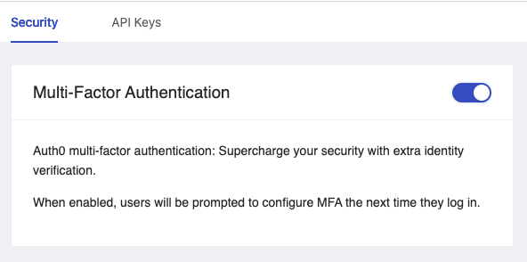

# How to Enable MFA/2FA

## Overview

You may want to increase to security for your Platform profile by enabling Multi-factor authentication (MFA)/ Two-factor authentication (2FA). This how to guide will walk you through the steps to enable this feature on your profile, and how it will effect your future login flow. 

## Steps

1. Navigate to [sign-up page](https://app.shipyardapp.com/user/settings) underneath your **My Profile** tab.
2. You should be able to see the Multi-factor Authentication card with a slide that can be toggled to enable and disable MFA/2FA.

3. Once enabled, on next login, the user will be prompted with a QR Code, that can be scanned using your preferred authenticator app. 
4. Once scanned, you can continue to use your authenticator's provided one-time code with each login until you choose to disable MFA/2FA for your profile.

:::tip success
You've now successfully enabled MFA/2FA for your profile.
:::
