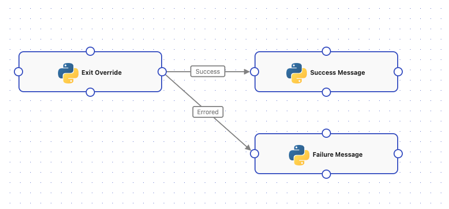
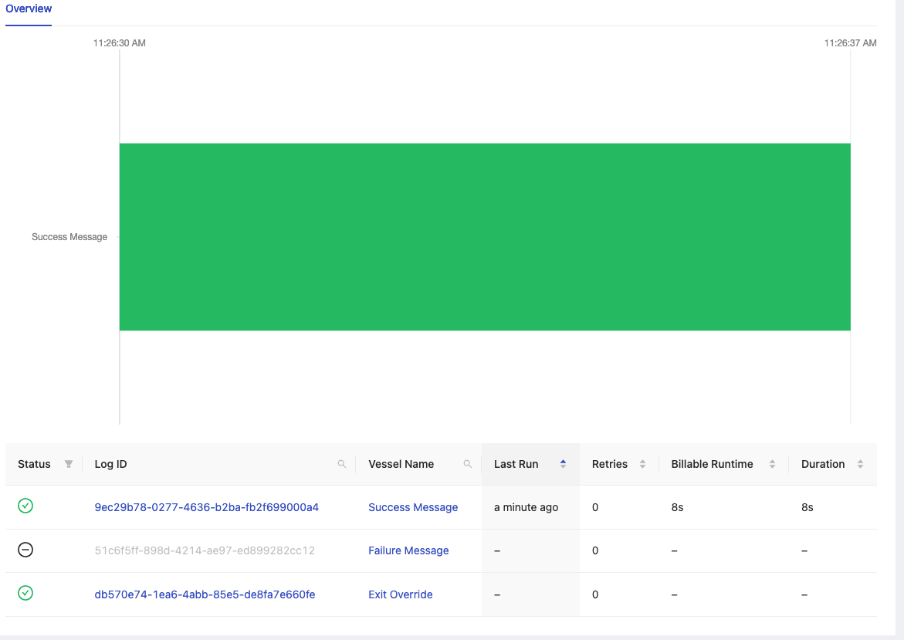
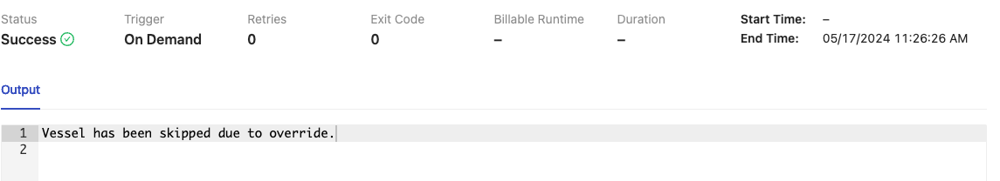
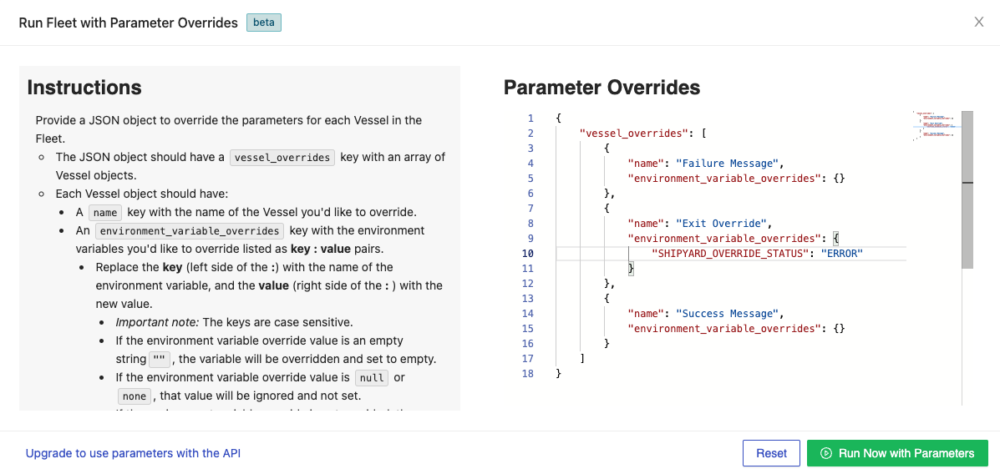
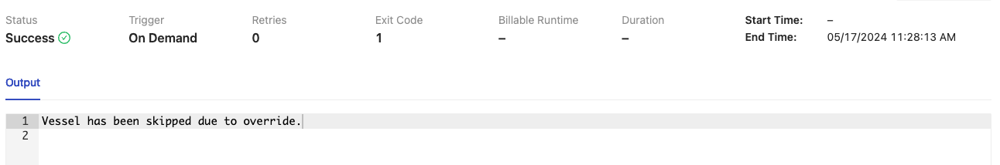

# How to Kick Off a Fleet to Run in the Middle

## Overview
Running a Fleet with a specific parameter allows you to override certain vessels that will skip the logic in those particular vessels and immediately run the subsequent vessels.

## Prerequisites
- Basic understanding of JSON.
- Familiarity with the Fleet and Vessel concepts in our application.
- Familiarity with running a Fleet with Parameters

## Steps

### Step 1 - Access a Fleet
- Navigate to the **Fleets** page.
- Click on the Fleet you want to run with parameter overrides.

### Step 2 - Open Parameter Overrides
- Click the button with the parameters symbol `{...}` to open the Parameter Overrides modal.


### Step 4 - Providing Parameter Override
- In the **Parameter Overrides** section, you will see a Vessel overrides JSON structure already created from the Vessels in your Fleet.
- The JSON structure will include:
    - A `vessel_overrides` key with an array of Vessel objects.
    - Each Vessel object will include:
        - A `name` key with the Vessel's name.
        - An `environment_variable_overrides` key with key-value pairs for the variables already within that Vessel. 
- You can edit the JSON structure directly in the editor.
- As you type, the editor will indicate any syntax errors or inconsistencies with your JSON structure.
- For the vessel(s) that you would like to skip/override, you will need to provide
  the specific variable: `SHIPYARD_OVERRIDE_STATUS`
  - If you would like that override to be skipped and continue to a vessel with a successful path (Exit Code `0`), you will need to provide either of the following values:
    - `"SHIPYARD_OVERRIDE_STATUS": "SUCCESS"`
    - `"SHIPYARD_OVERRIDE_STATUS": "SUCCESSFUL"`
  - If you would like that override to be skipped and continue to a vessel with an errored path (Exit Code `1`), you will need to provide either of the following values:
    - `"SHIPYARD_OVERRIDE_STATUS": "ERROR"`
    - `"SHIPYARD_OVERRIDE_STATUS": "ERRORED"`
  
### Step 5 - Check the Logs
- If a fleet has been skipped/overriden due to the `SHIPYARD_OVERRIDE_STATUS` Environment Variables being set, you will see that vessel be set with a status of "Success",
  and no billable runtime. However, you won't see any of the overriden vessels appear in the graph as well as the **Last Run**, **Retries**, **Billable Runtime**, and **Duration** remaining unset.

:::info

Although those runs do not appear on the graph, clicking into the logs for the overridden vessel will show an output of "Vessel has been skipped due to override."

:::


## Example JSON
```json
{
  "vessel_overrides": [
    {
      "name": "Override Vessel",
      "environment_variable_overrides": {
        "SHIPYARD_OVERRIDE_STATUS": "SUCCESS"
      }
    },
    {
      "name": "Success Vessel",
      "environment_variable_overrides": {
      }
    }
    {
     "name": "Failure Vessel",
     "environment_variable_overrides": {
     }
    }
  ]
}
```

## Screenshots

**Fleet Example With Success and Failure Paths**



**Override with Success Parameter**


**Log Overview**



**Success Override Log Output**



**Override with Error Parameter**



**Error Override Log Output**



## Limitations

1. Fleets can only be kicked off in the middle if all prior vessels have the `SHIPYARD_OVERRIDE_STATUS` properly set