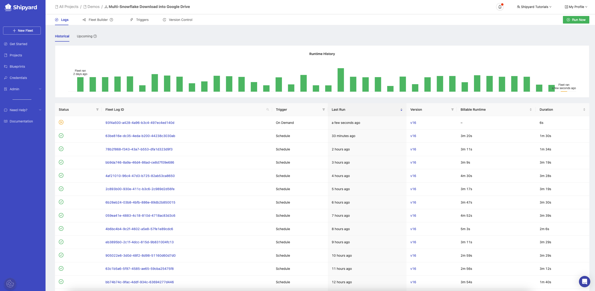
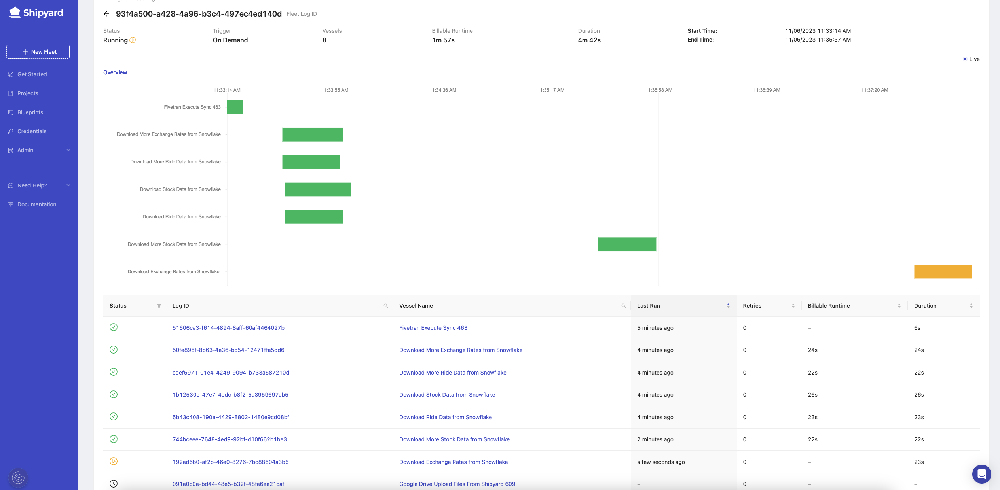
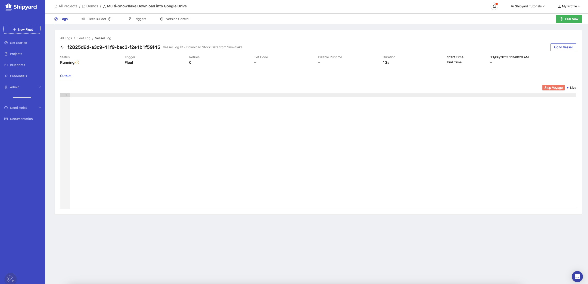

# How to Kill a Fleet's Voyage

## Overview

If you find writing a custom script with a neverending loop, know you made a mistake in the Fleet's setup, or accidently kicked off a Fleet to run, you may want to stop a [Fleet's](../../reference/fleets/fleets-overview.md) voyage. This how to guide will walk you through the steps to kill the voyage of a Fleet.

## Steps

### Step 1 - Find the Fleet

1. Navigate to the Project where your Fleet lives.
2. Find the Fleet whose run you want to kill and hover over the actions vertical-dot menu.
3. Click **Logs**. 

### Step 2 - Navigate to the Running Voyage

1. Find the Fleet that is running by looking for the yellow bar or yellow play sign under status.

2. Click on the yellow bar or the Fleet ID from the table to navigate to the running voyage.

### Step 3 - Navigate to the Running Vessel

1. Find the Vessel that is currently running by looking for the yellow bar or the yellow play sign under status.

2. Click on the yellow bar or the Fleet ID from the table to navigate to the running Vessel.

### Step 4 - Kill The Fleet Run

1. On the Vessel log page, find the red **Stop Voyage** button on the top right corner of the log. 

2. Click the button then select **Stop**.

:::tip success
You've now successfully killed a Fleet's voyage.
