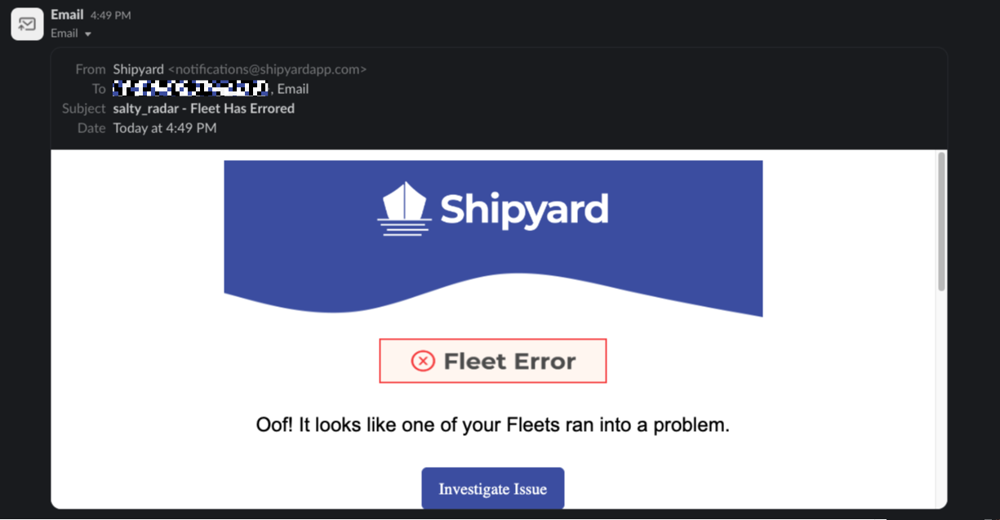

# How to Send Slack Notifications

## Overview
[Notifications](../../reference/notifications.md) allow you to send messages via email to alert team members when your Fleet or Vessel is successful, errors out, or is run manually. Sometimes, you may want your notifications to go to Slack instead of email.

:::warning
We only recommend this setup if you want to be notified in Slack when the *entire* Fleet errors, regardless at which step the failure occurred. If you want to have logic to send customizable messages based on specific Vessels erroring out or running successfully, we recommend using our [built-in Slack Blueprints](../../blueprint-library/slack/slack-overview.md)).
:::

## Steps

1. [Follow Slack's guide](https://slack.com/help/articles/206819278-Send-emails-to-Slack#create-an-email-address) to create an email address that sends messages to a specific Slack channel.
2. Add the email created in the previous step to the notifications field.
3. Save your Fleet.

:::tip success
You've now successfully created a Slack notification!
:::

Now, based on the options you chose, you will receive a message directly in the Slack channel associated with the email.

