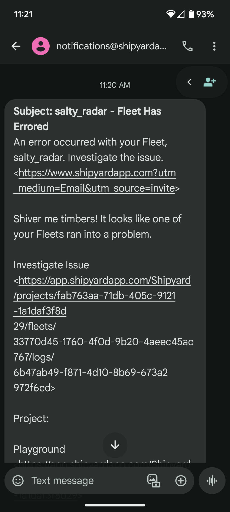

# How to Send Text (SMS/MMS) Notifications

## Overview
[Notifications](../../reference/notifications.md) allow you to send messages via email to alert team members when your Fleet or Vessel is successful, errors out, or is run manually. Sometimes, you may want your notifications to be texted to your phone instead of email.

## Steps

If you know the carrier of the phone you want to text, use the following table to determine the email.

| Carrier          | SMS Gateway Domain                | MMS Gateway Domain                |
|------------------|-----------------------------------|-----------------------------------|
| AT&T             | number@txt.att.net                | number@mms.att.net                |
| Boost Mobile     | number@sms.myboostmobile.com      | number@myboostmobile.com          |
| Cricket Wireless | number@mms.cricketwireless.net    | number@mms.cricketwireless.net    |
| Google Project Fi| number@msg.fi.google.com          | number@msg.fi.google.com          |
| Republic Wireless| number@text.republicwireless.com  |                               |
| Sprint           | number@messaging.sprintpcs.com    | number@pm.sprint.com              |
| Straight Talk    | number@vtext.com                  | number@mypixmessages.com          |
| T-Mobile         | number@tmomail.net                | number@tmomail.net                |
| Ting             | number@message.ting.com           |                               |
| Tracfone         | Depends on underlying carrier     | number@mmst5.tracfone.com         |
| U.S. Cellular    | number@email.uscc.net             | number@mms.uscc.net               |
| Verizon          | number@vtext.com                  | number@vzwpix.com                 |
| Virgin Mobile    | number@vmobl.com                  | number@vmpix.com                  |
| Bell Mobility    | number@txt.bellmobility.com       |                                   |
| Rogers           | number@pcs.rogers.com             |                                   |
| Fido             | number@fido.ca                    |                                   |
| Telus            | number@msg.telus.com              |                                   |
| Koodo            | number@msg.koodomobile.com        |                                   |
| Virgin Mobile    | number@vmobile.ca                 |                                   |

For example, if your number was 123-456-7890 and you used T-Mobile, your email would be 1234567890@tmomail.net.

1. Add the email discovered in the previous step to the notifications field.
2. Save your Fleet.

:::tip success
You've now successfully created a Text (SMS/MMS) notification!
:::

