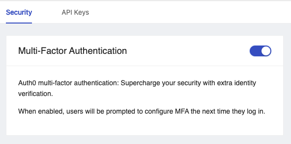

# How to Enable MFA/2FA

## Overview

You may want to increase security for your Shipyard account by enabling Multi-factor authentication (MFA)/ Two-factor authentication (2FA). This how to guide will walk you through the steps to enable this feature on your account.

:::note
MFA/2FA will only work for accounts that use username/password to log in. By default, if you use Google, GitHub, or another type of SSO for account login
:::

## Steps

1. Navigate to your [user settings](https://app.shipyardapp.com/user/settings) page by clicking  **My Profile** then **Settings**.
2. Under the **Security** tab, you should be able to see the Multi-factor Authentication card. Turn the switch on (purple) to enable MFA/2FA.

3. Once enabled, sign out of your account by clicking **My Profile** then **Sign Out**.
4. Sign back into your account. You will be prompted with a QR Code that can be scanned using your preferred authenticator app. 
5. Enter the one-time code presented by your authenticator app and click Continue.

:::tip success
You've now successfully enabled MFA/2FA for your profile. Now can continue to use your authenticator's provided one-time code with each login until you choose to disable MFA/2FA for your profile.
:::