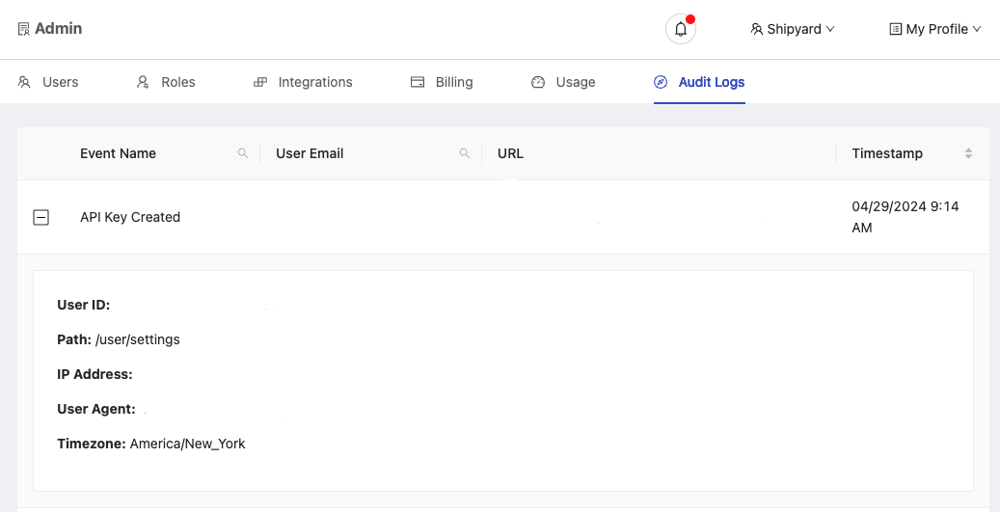
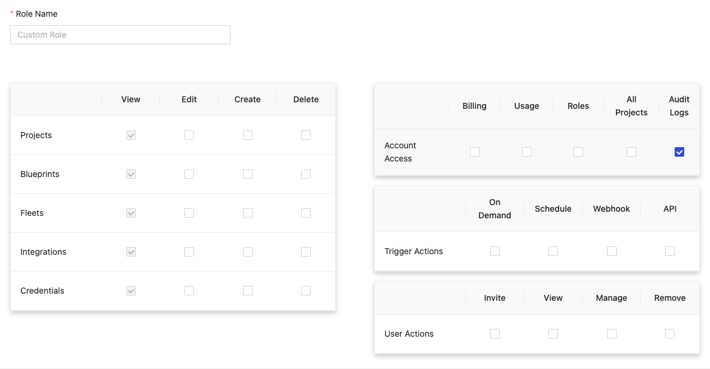

# Audit Logs

:::info

The Audit Logs feature is only available to Organizations on our **Enterprise Plan** and to users with the **Audit Logs Access**permission within those Organizations.

:::

## Definition
The Audit Logs provide a look into the events and actions of Users in your Organization in Shipyard. These logs provide various pieces of information such as the **Event Name**, **User Email** of the User who performed the event, the **URL** where the event took place, as well as the **Timestamp** of when the event took place. It's designed to help you monitor the actions and events of your Organiztion. In addition to the information above, we offer an expanded view of each event that includes:

- **User ID** of the User who performed the event
- **Path** which is a shortend string of the event URL
- **IP Address** of the User who performed the event
- **User Agent** of the User who performed the event
- **Timezone** in which the event occurred

:::warning

In the current iteration of this feature, Audit Logs require tracking to be enabled in our application. If you use an ad blockers, prevent JS from running, or limit cookie functionality, tracked details may be limited.

:::

## Screenshots

**Audit Logs**

**Audit Logs Access Permission**

## Limitations

1. The Audit Logs are only available to Organizations on Shipyard's **Enterprise** Plan
2. Only Users with **Audit Logs Access** have the ability to view logs
