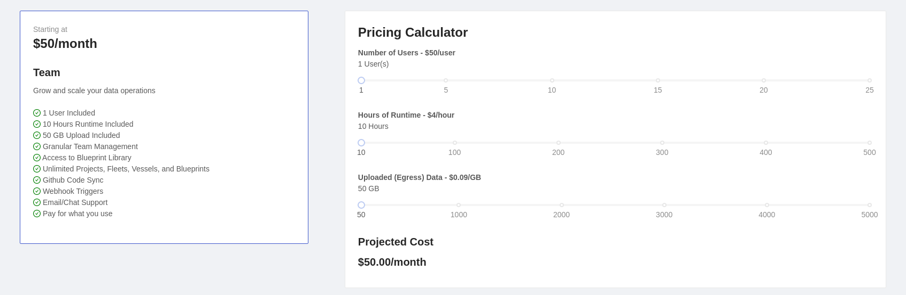
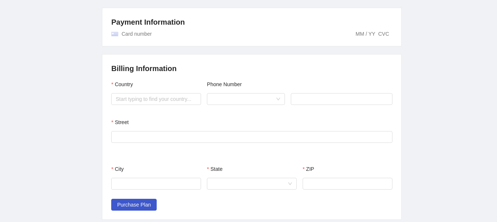

# Billing

## Definition

The billing section of the application allows you to select a recurring monthly plan and provide your payment information.

Once you have paid for a plan, clicking the billing button will take you to a billing portal where you can update your card information, change or cancel your subscription, and view invoices.

## Screenshots

