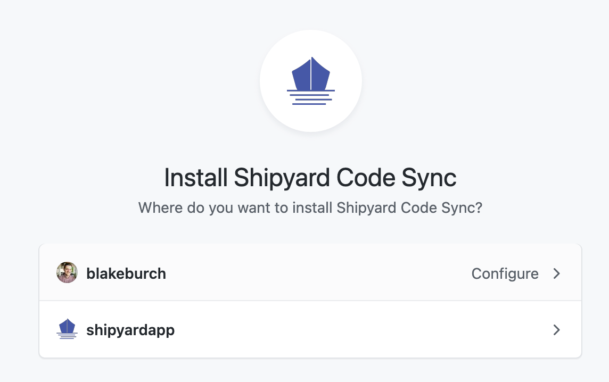

# GitHub Integration

## Definition

The GitHub integration allows you to set up [GitHub Code Sync](../../code/git-connection.md) for any of your Vessels or Blueprints.

Shipyard supports an unlimited number of GitHub connections to multiple different organizations. Every repository that is synced with Shipyard will be available to any user in the Organization with a Role that contains _Create_ or _Edit_ permissions for Vessels or Blueprints.

### Setup

By clicking **Add Connection**, you can choose to sync Shipyard to any GitHub organization that your GitHub account has access to. This setup flow allows you to specify whether to give Shipyard access to all repositories \(including newly created ones\) or only specific repositories. By default, Shipyard will have read-only access to the contents of the repositories you select.

Once a connection has been set up, you can always change the level of access after the fact. The **edit** button will redirect you to the GitHub application page where you can change repository access or delete the connection altogether.

## Screenshots

## Additional Notes

1. Shipyard has a 1:1 relationship when connecting to GitHub organizations. You cannot sync your personal organization in GitHub with two different organizations in Shipyard.

## Learn More

- [GitHub Code Sync Announcement](https://www.shipyardapp.com/blog/automating-github-code-sync/)
- [Getting Started with GitHub Code Sync](https://www.shipyardapp.com/blog/automate-deployment-github-code/)
