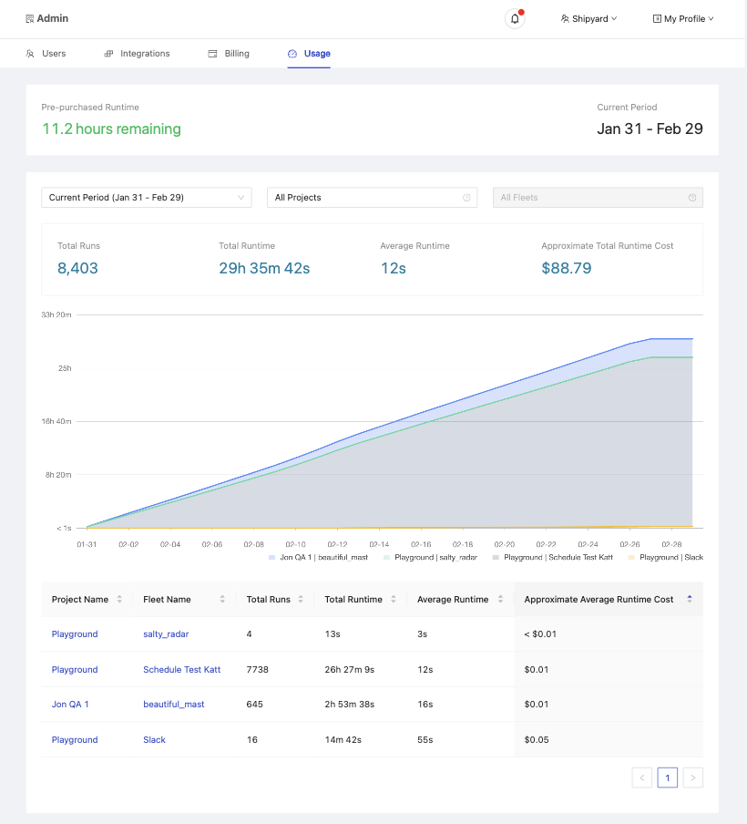

# Usage Dashboard

## Definition
The Usage Dashboard provides essential insights into your organization's activity on Platform, detailing usage statistics and their impact on your billing. It's designed to help you monitor and manage your organization's operations efficiently. The dashboard is divided into several sections, each offering specific information.

### Basic Organization Information

- **Pre-purchased Runtime**: Indicates the total runtime your organization has pre-purchased. Essential for organizations on the Developer Tier to run their Fleets, while those on paid plans may buy runtime in bulk or pay as they go.
- **Current Period**: Displays the current billing period, including its start and end dates.

### Filtered Usage Information

This section presents data that can be filtered by Period, Project, and Fleet, offering a tailored view of your organization's usage.

#### Overall Metrics

Based on the selected filters, you'll see:
- **Total Runs**: The cumulative count of the Fleet runs.
- **Total Runtime**: The total billable runtime of the Fleet runs.
- **Average Runtime**: The average billable runtime of the Fleet runs.
- **Approximate Total Runtime Cost**: An estimate of the total cost incurred by the runtime usage.

#### Usage Chart

A stacked area chart visualizing the total runtime per Fleet over the chosen period. Tooltips reveal the runtime accumulated from the start of the period to a specific date for each Fleet, alongside its percentage of the total runtime.

#### Usage Table

A detailed table providing metrics for each Fleet under the applied filters, including:
- **Project Name**: The project to which a Fleet belongs.
- **Fleet Name**: The name of the Fleet.
- **Total Runs**: How many times the Fleet has been run.
- **Total Runtime**: The total billable runtime of the Fleet.
- **Average Runtime**: The average billable runtime of the Fleet.
- **Approximate Average Runtime Cost**: The estimated average cost of the Fleet's runtime.

## Screenshots

## Additional Notes

1. The dashboard only shows usage data up to 90 days in the past.
2. The dashboard does not automatically refresh to show the latest data. You can refresh the page to see the most recent data.
3. The current billing period start and end date does not include the full day. For example, your Billing period can end at 4:03:11 PM on the 12th and start at 4:03:12 PM on the 12th.
4. Values in the dashboard are approximated and rounded for easier interpretation. On the actual invoice, usage is charged by the second.
