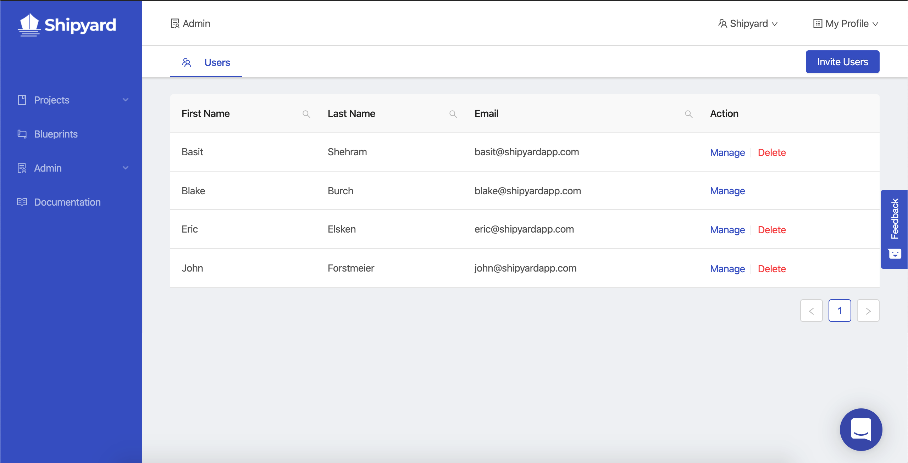
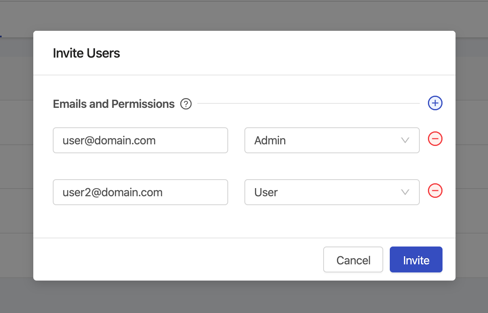

# User Management

## Definition

The User Management page gives Admins the ability to see and interact with all of the users that exist in their organization.

## Actions

### Inviting Users

Multiple users can be invited to the organization at the same time. Invitations require a valid email address and the selection of what their initial role should be.

- **User** - Create, View, and Edit access to all elements except for users.
- **Admin** - Full access to everything within your organization, as soon as they log in.

### Manage User Permissions

Clicking the **manage** action will lead to the [Permissions Panel](user-permissions.md) for that user.

### Deleting Users

Clicking the **delete** action will permanently remove that user's access from the organization.

## Screenshots

## Additional Notes

1. A user cannot delete themselves. That action must be performed by another Admin.
2. Users cannot be set to inactive, only deleted.
3. New user invites expire after 72 hours.
4. Newly invited users will not be displayed as members of your organization until they confirm their account.
