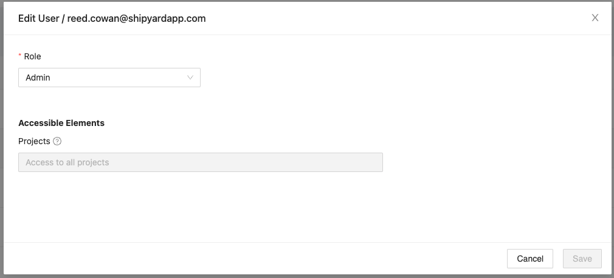

# User Management

## Definition

The User Management page gives Admins the ability to see and interact with all of the users that exist in their organization.

### Inviting Users

Multiple users can be invited to the organization at the same time. Invitations require a valid email address and the selection of what their initial role should be.

#### Roles

The roles that can be assigned to a user depend on the roles in your organization. This includes all predefined roles, and any custom roles that might have been created if your organization is on the Business or Enterprise plans. For more information on roles, please review our documentation [Roles](roles.md).

### Managing User Roles and Project Access

Clicking the **Edit** action will open up a modal that will allow you to assign a different role to that user and/or grant and remove access to projects in that organization

### Removing Users

Clicking the **Remove** action will permanently remove that user's access from the organization.

## Screenshots

**User Management Table** 

**Invite**

**Edit User**

## Additional Notes

1. A user cannot remove themselves. That action must be performed by another Admin.
2. Users cannot be set to inactive, only deleted.
3. New user invites expire after 72 hours.
4. Newly invited users will not be displayed as members of your organization until they confirm their account.
