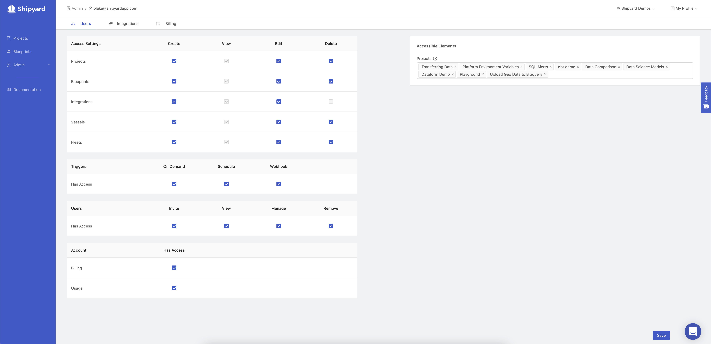

# User Permissions

## Definition

The User Permissions page contains all the options that determine the level of
access that a user has to your Organization's instance of Shipyard.
To view this page, a user must have the _View_ and _Edit_ permissions for the Users element.

Permissions are granted in a matrix that allows you to specify permission
levels for each element of the platform.

### Access Settings

- [Projects](../projects.md)
- [Blueprints](../blueprints/blueprints-overview.md)
- [Integrations](integrations/integrations-overview.md)
- [Vessels](../vessels.md)
- [Fleets](../fleets/fleets-overview.md)

#### Permissions

- **Create** - Ability to make new elements or duplicate existing ones.
- **View** - Ability to see and interact with an element.
- **Edit** - Ability to make changes to an existing element.
- **Delete** - Ability to remove the element permanently.

### Triggers

- [Has Access](../triggers/triggers-overview.md)

#### Permissions

- **On Demand** - Ability to run and stop a Voyage on demand from the applciation.
- **Schedule** - Ability to add Schedules to Vessels and Fleets and be able to stop
those Voyages triggered by a Schedule.
- **Webhook** - Ability to create and view Webhooks for Vessels and Fleets and be
able to stop those Voyages triggered by a Webhook.

### Users

- [Has Access](user-management.md)

#### Permissions

- **Invite** - Ability to invite Users to your Organization.
- **View** - Ability to view list of Users in your Organization.
- **Manage** - Ability to update Users in your Organization.
- **Remove** - Ability to remove Users from your Organization.

### Account

- [Billing](billing.md)
- [Usage](usage-dashboard.md)

#### Permissions

- **Has Access** - Abililty to view and update billing information and your Organzation's
usage dashboard.

### Accessible Elements

#### Projects

Choose which specific projects a user should have access to.
Project names are automatically completed as you type them.

## Screenshots

## Additional Notes

1. Access settings are applied at the Organization level.
In other words, a selected setting for an element will apply to every project
that a user has access to.
2. A user has access to all Vessels and all Fleets contained within a Project
that they have access to while respecting their Vessels and Fleets permissions.
3. The User Permissions page is the only way to view all projects that exist.
4. There is no way to guarantee that a user has access to all current and future projects.
If a user has _Create_ permissions for Projects, it is possible for them to
create a "_Rogue Project_" that only they have access to.
