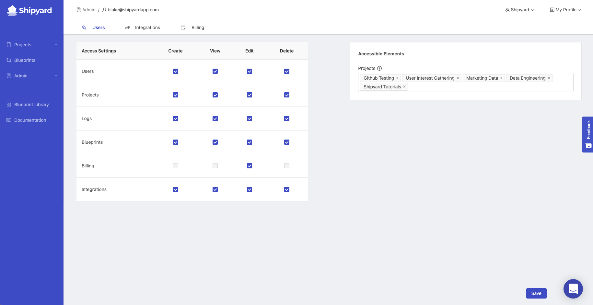

# User Permissions

## Definition

The User Permissions page contains all the options that determine the level of access that a user has to your Organization's instance of Shipyard. To view this page, a user must have the Edit permission for the Users element.

Permissions are granted in a matrix that allows you to specify permission levels for each element of the platform.

### Elements

- [Projects](../projects)
- [Blueprints](../blueprints/blueprints-overview)
- [Logs](../logs/logs-overview)
- [Users](user-management)
- [Billing](billing)
- [Integrations](integrations/integrations-overview)

### Permissions

- **Create** - Ability to make new elements or duplicate existing ones.
- **View** - Ability to see and interact with an element.
- **Edit** - Ability to make changes to an existing element.
- **Delete** - Ability to remove the element permanently.

### Accessible Elements

#### Projects

Choose which specific projects a user should have access to. Project names are automatically completed as you type them.

## Screenshots

## Additional Notes

1. Access settings are applied at the Organization level. In other words, a selected setting for an element will apply to every project that a user has access to.
2. You cannot currently restrict a user's ability to create, view, edit, and delete Vessels and Fleets. By default, a user has all permissions for these elements.
3. A user has access to all Vessels and all Fleets contained within a Project that they have access to.
4. The User Permissions page is the only way to view all projects that exist.
5. There is no way to guarantee that a user has access to all current and future projects. If a user has Create permissions for Projects, it is possible for them to create _Rogue Projects_ that only they have access to.
