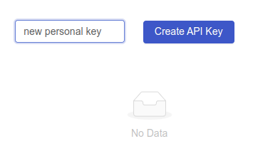

# API

## Overview

The **API** allows for programmatic access to a subset of Shipyard's features. This allows users to write scripts and programs to directly interact with the Shipyard platform instead of through the UI interface.

## Authorization

In order to interact with the API, an **API key** is required.

1. Navigate to the **Settings** page

2. On the right side of the page, enter a name in the **API key name** text field
3. Click the **Create API Key** button

4. Copy the generated API key value - _this is the **only time** the value will be available_

:::caution

Treat all API keys like passwords and do not commit them to code or share them with unauthorized parties

:::

Access for an API key can be revoked by clicking the **Delete** button next to its name in the list.

## Endpoints

TBD

<!-- EXAMPLE KEY -->
<!-- p1yfkloJnpVnS7VZRDLrw5reU3PNKlDKMel9GAny8lQ= -->