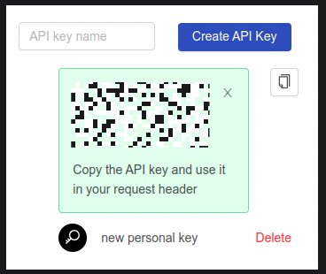

# API

## Overview

The **API** allows for programmatic access to a subset of Shipyard's features. This allows users to write scripts and programs to directly interact with the Shipyard platform instead of through the UI interface.

:::info
Shipyard's API is currently only available to customers on paid plans.

**Please Note**
1. The API is subject to change. The API is tightly coupled with the front end of the application, which is subject to change between releases. While endpoints usually won’t change that much, if you write code to use the API, you might have to update it in the future.
2. The API isn’t versioned. This means that functionality can change version to version, so don’t expect to stay on a particular version of Shipyard in order to use a “stable” API.
:::

## Authorization

In order to interact with the API, an **API key** is required.

1. Navigate to your user's [**Settings**](https://app.shipyardapp.com/user/settings) page


2. On the right side of the page, enter a name in the **API key name** text field
3. Click the **Create API Key** button


4. Copy the generated API key value - _this is the **only time** the value will be available_




:::caution

Treat all API keys like passwords and do not commit them to code or share them with unauthorized parties

:::

Access for an API key can be revoked by clicking the **Delete** button next to its name in the list.

## Endpoints

These are the currently available endpoints as well as example requests and responses. Note that the ID values would be substituted for the actual UUID values in a real-world request. The API key is the example one generated in the **Authorization** section above.

The response code snippets have been truncated for brevity.

### List Organizations

#### Request

```bash
curl https://api.app.shipyardapp.com/orgs --header "X-Shipyard-API-Key: <api-key>"
```

#### Response

```json
{
	"data_kind": "organizations",
	"data": [
		{
			"id": "11111111-1111-1111-1111-111111111111",
			"name": "example organization",
			"created_at": "2019-08-22T21:53:30.095954Z",
			...
		}
	]
}
```

### List Organization Fleets

#### Request

```bash
curl https://api.app.shipyardapp.com/orgs/11111111-1111-1111-1111-111111111111/fleets --header "X-Shipyard-API-Key: <api-key>"
```

#### Response

```json
{
	"data_kind": "fleets",
	"data": [
		{
			"org_id": "11111111-1111-1111-1111-111111111111",
			"id": "33333333-3333-3333-3333-333333333333",
			"name": "confident_oyster",
			"pallet_ids": [
				"44444444-4444-4444-4444-444444444444"
			],
			"created_at": "2022-07-21T21:37:30.623386Z",
			"vessel_dag": {
				"vertices": [
					"44444444-4444-4444-4444-444444444444"
				],
				"versions": [
					1
				],
				"edges": []
			},
			...
		}
	]
}
```
### Get Fleet

#### Request

```bash
curl https://api.app.shipyardapp.com/orgs/11111111-1111-1111-1111-111111111111/projects/22222222-2222-2222-2222-222222222222/fleets/33333333-3333-3333-3333-333333333333 --header "X-Shipyard-API-Key: <api key>"
```

#### Response

The Fleet is returned in [FAC YAML](fleets/yaml-editor.md) format.

```yaml
name: example fleet
vessels:
    first_vessel:
	...
```

### Upsert Fleet

#### Request

```bash
curl -X PUT https://api.app.shipyardapp.com/orgs/11111111-1111-1111-1111-111111111111/projects/22222222-2222-2222-2222-222222222222/fleets --data-binary @fleet.yaml --header "Content-type: application/yaml" --header "X-Shipyard-API-Key: <api-key>"
```

The contents of `fleet.yaml` would be in the required [FAC format](fleets/yaml-editor.md).

#### Response

The Fleet is returned in [FAC YAML](fleets/yaml-editor.md) format.

```yaml
name: example fleet
vessels:
    first_vessel:
	...
```


### List Fleet Runs

#### Request

```bash
curl https://api.app.shipyardapp.com/orgs/11111111-1111-1111-1111-111111111111/projects/22222222-2222-2222-2222-222222222222/fleets/33333333-3333-3333-3333-333333333333/runs --header "X-Shipyard-API-Key: <api-key>"
```

#### Response

The Fleet Runs are returned in CSV format.

```csv
Fleet ID,Fleet Name,Fleet Version,...
fleet_id,example fleet,1,...
```

Below is a reference table for the Fleet Runs CSV.

| Column | Description |
|---|---|
| Fleet ID | The UUID of the associated Fleet |
| Fleet Name | The name of the associated Fleet |
| Fleet Version | The version number of the associated Fleet |
| Fleet Log ID | The UUID of the Fleet Run log |
| Status | The status the Fleet Run completed in |
| Start Time | The time the Fleet Run started |
| End Time | The time the Fleet Run ended |
| Duration | The length of time the Fleet Run ran for |
| Billable Runtime | The length of time the Fleet Run ran the customer will be billed for |
| Vessels Count | The number of Vessels in the associated Fleet |
| Trigger | The method the Fleet Run was started by |

### List Voyages

#### Request

This request returns all of the Voyages in the requested Organization.

```bash
curl https://api.app.shipyardapp.com/orgs/11111111-1111-1111-1111-111111111111/voyages --header "X-Shipyard-API-Key: <api-key>"
```

#### Response

The Voyages are returned in CSV format.

```csv
Fleet ID,Fleet Name,Fleet Version,...
fleet_id,example fleet,1,...
```

Below is a reference table for the Fleet Runs CSV.

| Column | Description |
|---|---|
| Fleet ID | The UUID of the Fleet |
| Fleet Name | The name of the Fleet |
| Fleet Version | The version number of the Fleet |
| Fleet Log ID | The UUID of the Fleet log |
| Fleet Log Trigger | The method the Fleet was started by |
| Fleet Log Status | The status the Fleet completed in |
| Vessel Log ID | The UUID of the Vessel log |
| Vessel Status | The status the Vessel completed in |
| Vessel Name | The name of the Vessel |
| Vessel Trigger | The method the Vessel was started by |
| Retries | The number of times the Vessel attempted to run |
| Exit Code | The final exit code for the Vessel final run |
| Vessel Start Time | The time the Vessel started |
| Vessel End Time | The time the Vessel ended |
| Duration | The length of time the Fleet ran for |
| Billable Runtime | The length of time the Fleet ran the customer will be billed for |

### Create External File

#### Request

This request is used to upload a file containing the code to be executed as part of a Vessel. Note that it is a prerequisite for **Create Blueprint** and optionally **Updated Blueprint** endpoints below.

```bash
curl -X POST https://api.app.shipyardapp.com/orgs/11111111-1111-1111-1111-111111111111/temporary_external_files --header "X-Shipyard-API-Key: <api-key>" -F file=@script.py
```

As an example, the contents of `script.py` are:

```python
print('hello, world!')
```

#### Response

The response is returned in JSON format.

```json
{
	"data":{
		"RequestID":"99999999-9999-9999-9999-999999999999",
		"ExternalFile":"s3://production-shipyard-uploads-tmp/tmp/organizations/11111111-1111-1111-1111-111111111111/requests/99999999-9999-9999-9999-999999999999.sefv2_00000000-0000-0000-0000-000000000000"
	}
}
```

The request ID and external file URL will both be used in subsequent requests to the API.