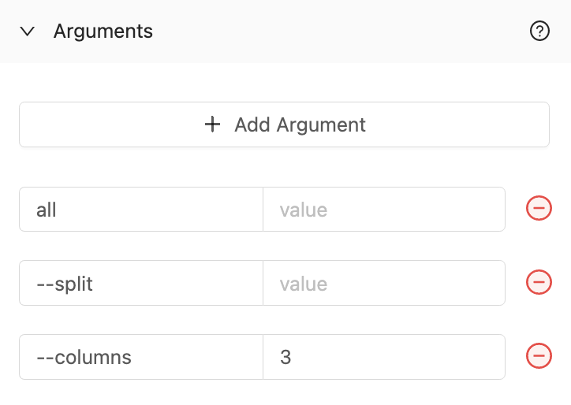

import Tabs from '@theme/Tabs';
import TabItem from '@theme/TabItem';

# Command

## Definition

Arguments are comprised of flags and values. They are added at the end of the execution command to run your script in the order they are entered (although generally, the order should not matter). These are typically used when the code you're running is built as a command line interface (CLI).

Arguments can be passed in 3 different ways:
- With only a Value (must be placed in the first column) (e.g. `all`)
- With only a Flag (e.g. `--split`)
- With a Flag and a Value (e.g. `--columns 3`)

:::caution
Command arguments are not suitable for secrets. They are available to change the behavior of your script with values that are not secret, like a file name to process or column names in a table to work with. For secrets, use [environment variables](environment-variables/environment-variables-overview.md)
:::

## Screenshots

