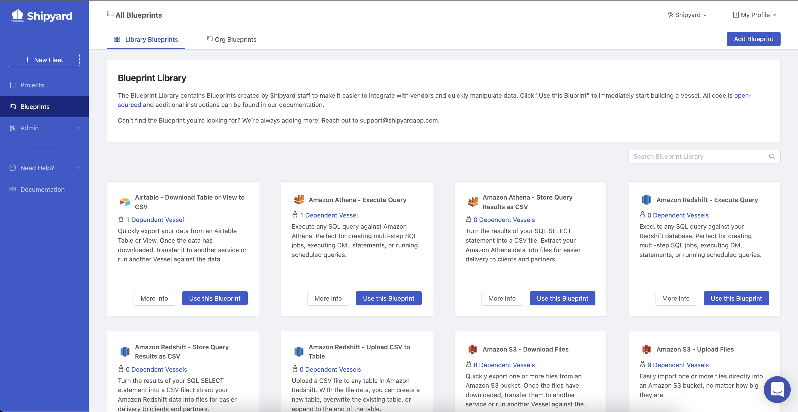

# Blueprint Library

## Definition

The Blueprint Library is a location for pre-made [Blueprints](../blueprints-overview.md) developed by Shipyard staff. These Blueprints provide an easy way to avoid monotonous development work associated with integrations.

Library Blueprints are designed to:

- Accomplish a single common action with a single vendor
- Require minimal details and credentials to get started
- Require no coding

Library Blueprints are immediately available to every user in an organization. These Blueprints are constantly updated and monitored by our team. If you run into connection issues or general errors, contact [support@shipyardapp.com](mailto:support@shipyardapp.com)

In an effort to be transparent about how our Blueprints work, we open-source the code and make it available in a single repository on our [GitHub](https://github.com/shipyardapp/shipyard-blueprints/tree/main/shipyard_blueprints). The repository is broken up into folders by vendor. If some functionality isn't working appropriately, you can open an issue in GitHub or submit a pull request with the proposed changes.

## Free Blueprints
A portion of our Blueprints are 100% free, never incurring [billable runtime](../../../faqs/plans/billable-runtime.md). These Blueprints are marked with "Trigger" in the name and are labeled in the application as "Free".

For example, you may run a job on an external service like dbt Cloud, a process that could take multiple hours to finish. The majority of runtime in these instances is spent waiting for the external service to finish running the job rather than actively processing data on our platform. Instead of charging customers for this "wait time", we choose to make these Blueprints free because their primary function is orchestrating the external service to run a job.

Our definition of Free Blueprints is always evolving. If there's ever a Blueprint you feel meets this condition that isn't classified as free, please reach out to support. 

## Structure of the Blueprint Library

Blueprints are broken down into a few categories with core functionality that should be achieved. The following is a list of the integrations currently built out and the common actions related to each category.

### Databases
 
#### Integrations
- [Amazon Athena](../../../blueprint-library/amazon-athena/amazon-athena-overview.md)
- [Amazon Redshift](../../../blueprint-library/amazon-redshift/amazon-redshift-overview.md)
- [Databricks SQL Warehouse](../../../blueprint-library/databricks-sql-warehouse/databricks-sql-warehouse-overview.md)
- [Google BigQuery](../../../blueprint-library/google-bigquery/google-bigquery-overview.md)
- [Microsoft SQL Server](../../../blueprint-library/microsoft-sql-server/microsoft-sql-server-overview.md)
- [MySQL](../../../blueprint-library/mysql/mysql-overview.md)
- [PostgreSQL](../../../blueprint-library/postgresql/postgresql-overview.md)
- [Snowflake](../../../blueprint-library/snowflake/snowflake-overview.md)

#### Actions
- Execute SQL Query
- Download Query Results to Shipyard
- Upload File to Table from Shipyard

### Cloud Storage

#### Integrations
- [Amazon S3](../../../blueprint-library/amazon-s3/amazon-s3-overview.md)
- [Azure Blob Storage](../../../blueprint-library/azure-blob-storage/azure-blob-storage-overview.md)
- [Box](../../../blueprint-library/box/box-overview.md)
- [Dropbox](../../../blueprint-library/dropbox/dropbox-overview.md)
- [FTP](../../../blueprint-library/ftp/ftp-overview.md)
- [Google Cloud Storage](../../../blueprint-library/google-cloud-storage/google-cloud-storage-overview.md)
- [Google Drive](../../../blueprint-library/google-drive/google-drive-overview.md)
- [SFTP](../../../blueprint-library/sftp/sftp-overview.md)
- [Databricks](../../../blueprint-library/databricks/databricks-overview.md)

#### Actions
- Download Files to Shipyard
- Upload Files from Shipyard
- Move or Rename Files
- Delete Files

### Spreadsheets

#### Integrations
- [Airtable](../../../blueprint-library/airtable/airtable-overview.md)
- [Google Sheets](../../../blueprint-library/google-sheets/google-sheets-overview.md)
- [Notion](../../../blueprint-library/notion/notion-overview.md)
- [Smartsheet](../../../blueprint-library/smartsheet/smartsheet-overview.md)

#### Actions
- Download Sheet to Shipyard
- Upload File to a Sheet from Shipyard
- Clear Sheet Contents

### Messaging

#### Integrations
- [Email](../../../blueprint-library/email/email-overview.md)
- [Microsoft Teams](../../../blueprint-library/microsoft-teams/microsoft-teams-overview.md)
- [Slack](../../../blueprint-library/slack/slack-overview.md)

#### Actions
- Send Message
- Send Message Conditionally
- Send Message w/ Attachment

### Data Visualization

#### Integrations
- [Domo](../../../blueprint-library/domo/domo-overview.md)
- [Looker](../../../blueprint-library/looker/looker-overview.md)
- [Microsoft Power BI](../../../blueprint-library/microsoft-power-bi/microsoft-power-bi-overview.md)
- [Mode](../../../blueprint-library/mode/mode-overview.md)
- [Tableau](../../../blueprint-library/tableau/tableau-overview.md)
- [Thoughtspot](../../../blueprint-library/thoughtspot/thoughtspot-overview.md)

#### Actions
- Download Dashboard/View/Card/Report as File to Shipyard
- Trigger Dataset Refresh

### Data Tooling (Ingestion, Transformation, Reverse ETL, and Syncing)

#### Integrations
- [Airbyte](../../../blueprint-library/airbyte/airbyte-overview.md)
- [Census](../../../blueprint-library/census/census-overview.md)
- [Coalesce](../../../blueprint-library/coalesce/coalesce-overview.md)
- [dbt Cloud](../../../blueprint-library/dbt-cloud/dbt-cloud-overview.md)
- [Fivetran](../../../blueprint-library/fivetran/fivetran-overview.md)
- [Hex](../../../blueprint-library/hex/hex-overview.md)
- [Hightouch](../../../blueprint-library/hightouch/hightouch-overview.md)
- [Portable](../../../blueprint-library/portable/portable-overview.md)
- [Rudderstack](../../../blueprint-library/rudderstack/rudderstack-overview.md)

#### Common Actions
- Trigger Job
- Download Results from Job to Shipyard
- Trigger Job and Download Results to Shipyard (All-in-one)

### Project Management

#### Integrations
- [Asana](../../../blueprint-library/asana/asana-overview.md)
- [Clickup](../../../blueprint-library/clickup/clickup-overview.md)
- [Jira](../../../blueprint-library/jira/jira-overview.md)
- [Shortcut](../../../blueprint-library/shortcut/shortcut-overview.md)
- [Trello](../../../blueprint-library/trello/trello-overview.md)

#### Actions
- Create Task
- Edit Task

### Customer Resource Management (CRM)

#### Integrations
- [Hubspot](../../../blueprint-library/hubspot/hubspot-overview.md)
- [Salesforce](../../../blueprint-library/salesforce/salesforce-overview.md)

#### Actions
- Download Data to Shipyard
- Upload Data from Shipyard

### 3rd-Party APIs

#### Integrations
- [HTTP](../../../blueprint-library/http/http-overview.md)

#### Actions
- HTTP Request
- Download File from URL to Shipyard

### File or Data Manipulation

#### Integrations
- [Data Manipulation](../../../blueprint-library/data-manipulation/data-manipulation-overview.md)
- [File Manipulation](../../../blueprint-library/file-manipulation/file-manipulation-overview.md)

#### Actions
- Compress Files
- Decompress Files
- Convert Files
- Compare File Contents

## Screenshots

## Learn More

- [Explore the Blueprints in the Blueprint Library](https://www.shipyardapp.com/blueprint-library)
