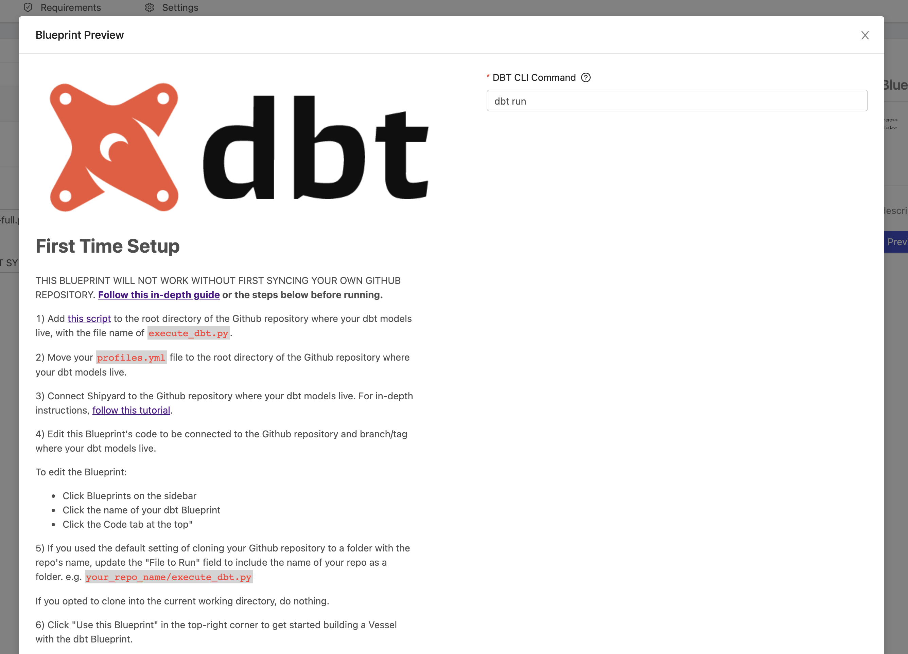

# Blueprint Preview

## Definition

The Blueprint preview functionality provides a quick snapshot of how your Blueprint will look to users whenever you save it.

The preview consists of two parts:

- On the left-hand side, you'll see what your Blueprint Description will look like with Markdown formatting.
- On the right-hand side, you'll see what your Blueprint Variables will look like as inputs.

## Screenshots

## Limitations

1. When you navigate away from the preview, all data entered will be removed.
2. The preview does not check for required fields, but it does show the red asterisk next to required fields.
3. The preview will show all unsaved, staged changes. If you like the way the Blueprint looks, you'll need to remember to save.
