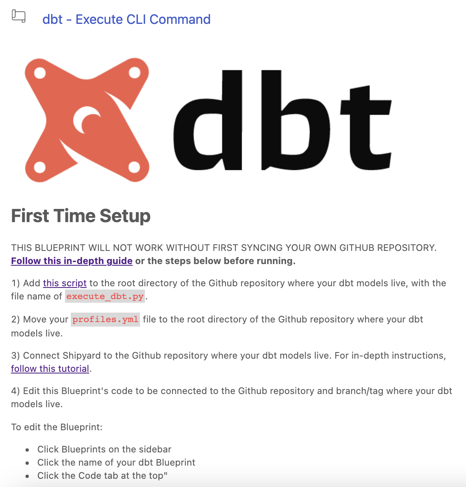

# Blueprint Description

## Definition

The Blueprint Description field allows for writing long-form descriptive instructions related to the Blueprint. This description will be displayed on the left-hand side of the screen when a user builds a Vessel with a Blueprint.

This field supports [standard Markdown formatting](https://www.markdownguide.org/basic-syntax/).

## Screenshots

