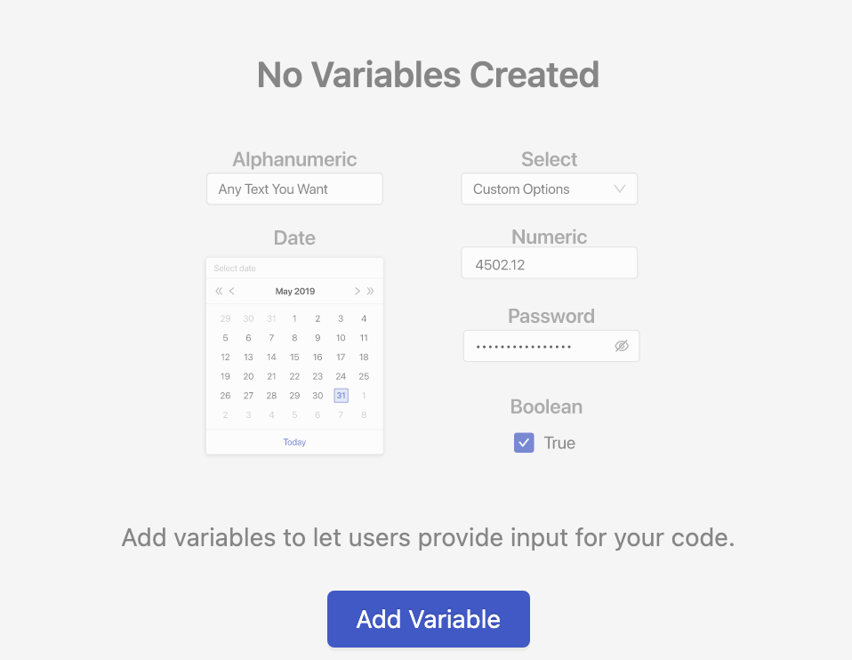

# Blueprint Variables

## Definition

Blueprint Variables allow your code to accept user input through the Platform UI that gets stored and made available to your code as an [environment variable](../../environment-variables/environment-variables-overview.md).

A Blueprint can contain as many variables as you want. Blueprint variables can also be re-ordered to make it easier for users to understand.

A user who creates a Vessel from your Blueprint will provide their own values on the [Input](../../inputs.md) panel for Blueprint Variables that you define. Those user entered values then become available at runtime.

## Components

### Display Name

A required string of letters and digits. This name will be shown to a user on the input panel.

### Reference Name

- A required string of letters and digits
- Must be unique \(case sensitive\) within a Blueprint
- Must not contain whitespace or special characters other than `_`

This name will be translated into an [environment variable](../../environment-variables/environment-variables-overview.md) with the same name, used to reference the input data in your script. 

### Variable Type

A required high-level choice that helps provide validation for the user input. The following are the currently available variable types:

- **Alphanumeric -** Lets the user provide a string of text.
There is an additional toggle for allowing multiline values to be input with a textarea.
- **Integer -** Lets the user provide a number.
- **Floating Point -** Lets the user provide a decimal number.
- **Boolean** - Lets the user select either a `TRUE` or `FALSE` value in the form of a checkbox.
- **Date** - Lets the user provide a date, using a date selector, in the `YYYY-MM-DD` format.
- **Select -** Lets a Blueprint creator define a restricted set of valid values as Select Options. These values contain both a Display Name, shown to the user, and an Internal Value, passed to the code. Requires at least one option.
- **Password** - Allows the user to provide a string that gets hidden by default. Upon saving, this data will not be sent to the UI and will show as `(hidden)`. This behavior is similar to how [environment variables](../../environment-variables/environment-variables-overview.md) are handled.
There is an additional toggle for allowing multiline values to be input with a textarea.

:::caution
Regardless of which variable type is selected, the user input will always passed back to your code as a string. Your code will need to appropriately translate the input into the required data type.
:::

### Default Value

A field that provides a mechanism for defining the default value that should be passed to the code if the user does not specify one when creating the Vessel. This field changes based on the variable type selected and is required for the **Select** variable type.

### Required?

Indicates whether or not the user will have to provide this value in order to build a Vessel successfully. Presents the user with an error message if the field is not filled out.

### Placeholder

An option field to show greyed out text in the input field before the user provides input. Helpful for providing example values.

### Tooltip

Text will display in a tooltip next to the variable name. This should be provided for ease of use, letting users of your Blueprint know what value should be input and what your Blueprint is going to do with that value.

## Accessing Variable Values

All of the user input provided when setting up a Vessel will be provided to your code at runtime. There are two ways to access the user input provided to a Blueprint Variable:

### Pass Variable Values to Code

You can obtain the variable's value via either the [arguments](../../arguments.md) or as an [environment variable](../../environment-variables/environment-variables-overview.md) by referencing the variable using `${variable_name}`. The variable name will **exactly match** the Blueprint Variable's [Reference Name](blueprint-variables.md#reference-name).

For example, if a variable's reference name is `Operator_A`, then you would reference it by typing`${Operator_A}`.

If you reference a `${variable_name}` that does not exist, the value will be returned as `None`.

We recommend this option, as it makes it extremely clear which variables are being passed to the script and how they are being used.

### Set Variables Using Environment Variables

In your code, you can obtain the value for the variable just like you would any other environment variable. The environment variable name will **exactly match** the Blueprint Variable's [Reference Name](blueprint-variables.md#reference-name). For example, if a variable's reference name is `Operator_A`, then its environment variable name will be `Operator_A`.

View our [how-to guide for accessing Environment Variables](../../../how-tos/environment-variables/access-environment-variables-with-code.md).

:::caution
A Blueprint's environment variables and Blueprint variables **are both** set as environment variables that can be accessed at runtime. It's important to make sure that the naming between these two sections doesn't overlap.
:::

:::danger
Make sure not to set any variables to important environment variable names like `PATH` or `HOME` unless you _really_ know what you're doing.
:::

## Handling Updates

One of the benefits of using Blueprints is that updates made to the Blueprint get made to every single Vessel built with that Blueprint. However, changes to the Blueprint could result in errors when your existing Vessels run if you're not careful.

If you add or remove an input on an existing Blueprint that's already used by other Vessels, we do our best to get you out of trouble and keep your Vessels running smoothly. 

- If a new input is required, existing Vessels will use the default value if it's available. If not, an empty string will be used as the value.
- If an existing input is suddenly required and the input was blank, existing Vessels will use the default value if it's available. If not, an empty string will be used as the value.
- If the new input is not required, an empty string will be used as the value.
- If a previously available select option is removed, Vessels will continue to use the previously set value.
- If an input is removed, it will no longer be used by existing Vessels.
- In all other cases, if a value was previously set on a field, that value will continue to be used.

In all of the above instances, these Vessels will throw a warning that encourages you to update the Vessel. Changes to a Fleet cannot be saved until these issues are fixed.

## Screenshots

## Additional Notes

1. A Blueprint cannot have two variables with the same display name.
2. A Blueprint variable cannot be conditionally shown or hidden based on a user's selection.
3. There is no built-in system to ensure that `${variable_name}` exactly matches a reference name. Make sure you don't have typos!

## Learn More

- [How to Create Blueprint Variables](../../../how-tos/blueprints/create-blueprint-variables.md)
- [How to Reference a Blueprint Variable](../../../how-tos/blueprints/reference-blueprint-variables.md)
- [How to Reorder Blueprint Variables](../../../how-tos/blueprints/reorder-blueprint-variables.md)
