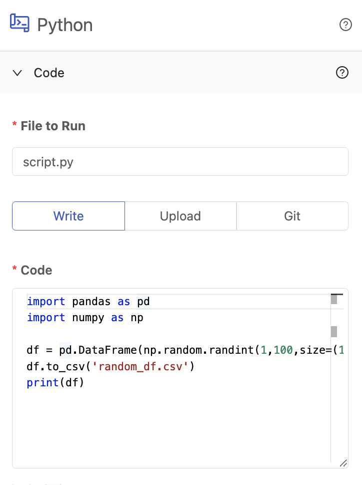

# Code

## Definition

The Code panel contains all of the details necessary to run your scripts as Vessels. Contents of this panel may differ slightly based on the language selected. Platform currently supports executing code written in Python, Node, or Bash (which can [effectively install and run any language](../../tutorials/non-native-language-vessels.md)).

There are 3 different methods to provide code:

- [Write Code](write-code.md)
- [Upload Code](upload-code.md)
- [GitHub Code Sync](git-connection.md)

At the top of the code panel, you'll see a field for **File To Run**. In the case of Uploading Code or cloning code from GitHub, this should represent the combined folder and file name of the script that you want to execute. When writing code, this name represents both the script name of the code you provided and the name of script to be executed.

All code executed on our platform is subject to our [Terms of Service](https://www.shipyardapp.com/legal/terms).

## Screenshots

