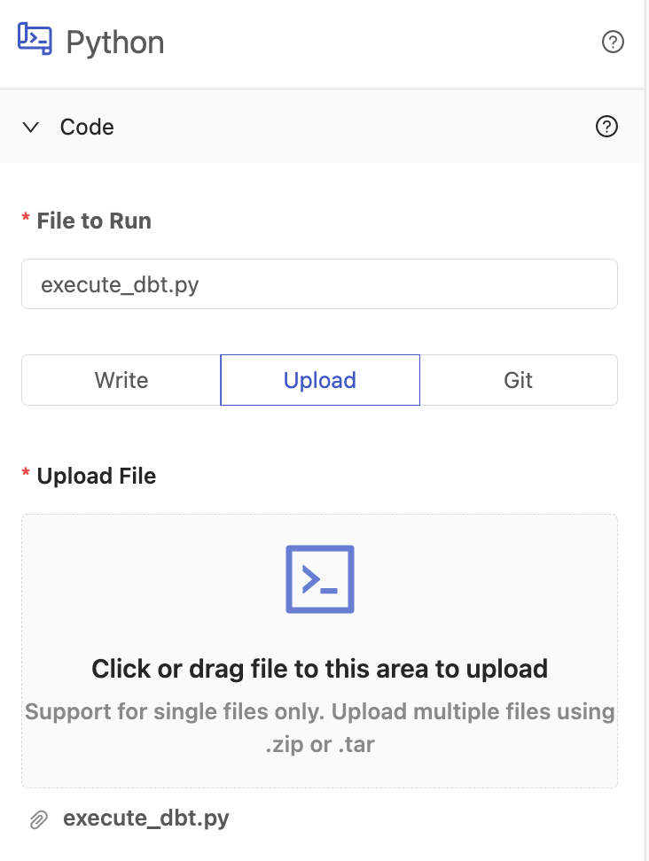

# Upload Code

## Definition

The file upload system allows you to upload a single file on your machine that contains the necessary components for your code to work.

After uploading a file, the uploaded file name will remain present. Clicking the file name will download the contents back to your local machine. Uploading a new file will remove the existing file and replace it with the new file. Clicking the trash icon will remove the existing file altogether.

Platform only supports uploading and storing a single file per Vessel. If you have multiple files that your script uses, you will need to compress the files together and upload that file. Upon running your Vessel, Platform will automatically decompress the contents to the home directory.

## Screenshots

## Additional Notes

1. Every time you upload a file using the upload method, the new upload **replaces everything** that has previously been uploaded, **including** any text in the in-app editor.
2. Only `.zip` and `.tar` compression formats are decompressed at runtime. There is no support for `.7z` `.gz` `.bz3` `.xz` or `.lz`
3. Automatic decompression only happens at the highest level. Platform will not decompress multiple levels of folders or files.

## Learn More

- [How to Download Uploaded Code](../../how-tos/code/download-code.md)
