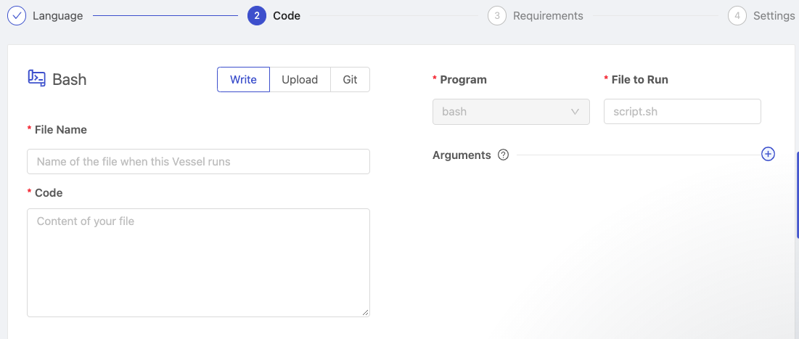

# Write Code

## Definition

The in-app editor allows you to copy and paste your code directly into Shipyard or write your code from scratch. The editor allows you to make changes directly in the UI as needed. This solution is perfect for smaller code snippets that you may need to change and edit on the fly.

If the write option is selected, both the **file name** and **code** fields must be filled out. When first setting up a Vessel or Blueprint, the **file name** that you type will be mirrored in the [file to run](command.md#file-to-run) field, effectively ensuring that the script you're writing is the script that will be run. Once saved, the fields will be treated separately.

## Screenshots

## Additional Notes

1. The in-app editor only supports editing one file per Vessel.
2. You cannot include folder names in the **file name** field. The file will always be created in the home directory.
