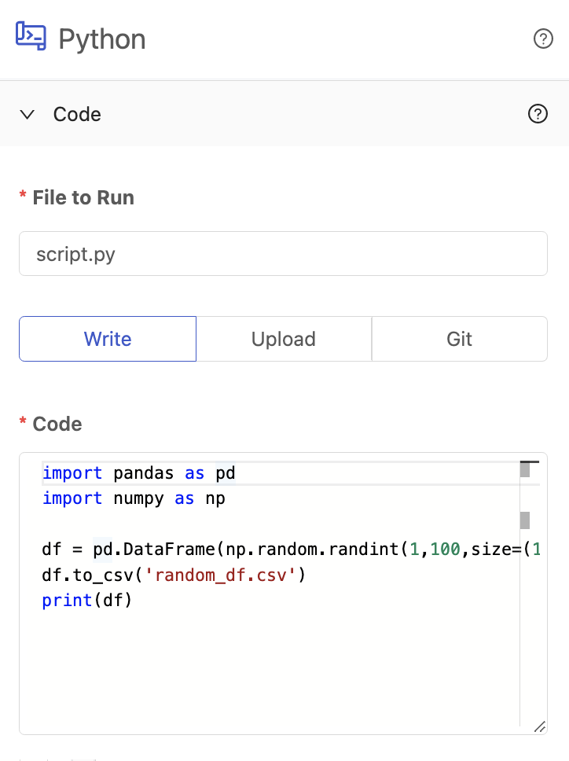

# Write Code

## Definition

The in-app editor allows you to copy and paste your code directly into Platform or write your code from scratch, allowing you to make changes directly in the UI as needed. This solution is perfect for smaller code snippets that you may need to change and edit on the fly.

This editor is built using [monaco-editor](https://microsoft.github.io/monaco-editor/), the same underlying base as VSCode. The editor will automatically perform syntax highlighting based on the language you selected. In addition, you can press **ctrl+f** to bring up functionality to find and replace text in your code. 

When writing code, the **File To Run** field represents both the script name of the code you provided and the name of script to be executed.

## Screenshots

## Additional Notes

1. The in-app editor only supports editing one file per Vessel.
2. You cannot include folder names in the **File To Run** field when writing code. The file will always be created in the home directory.
