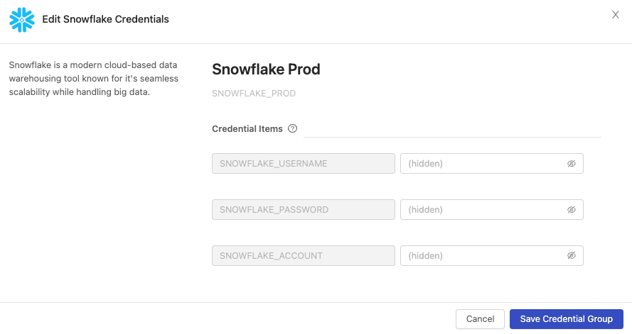
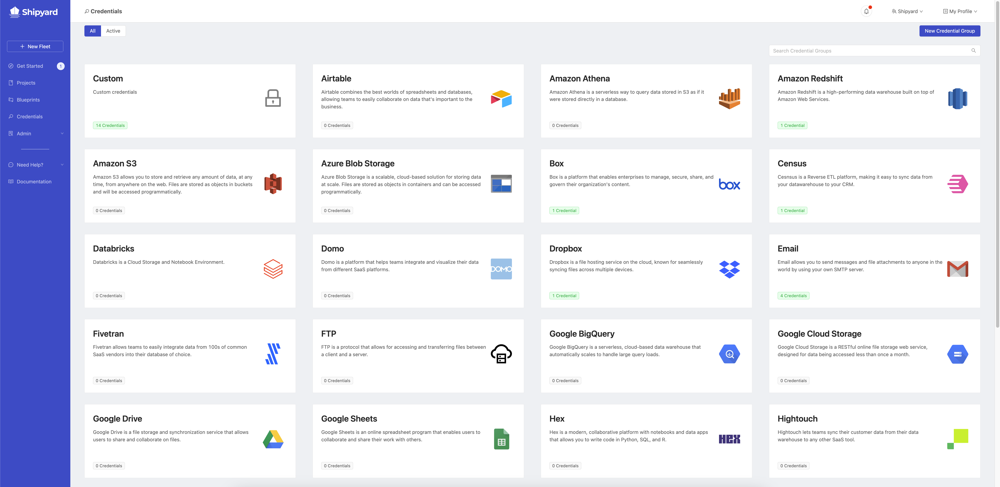
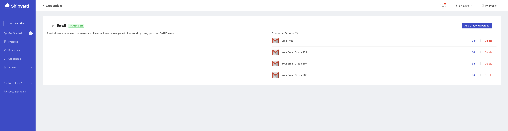
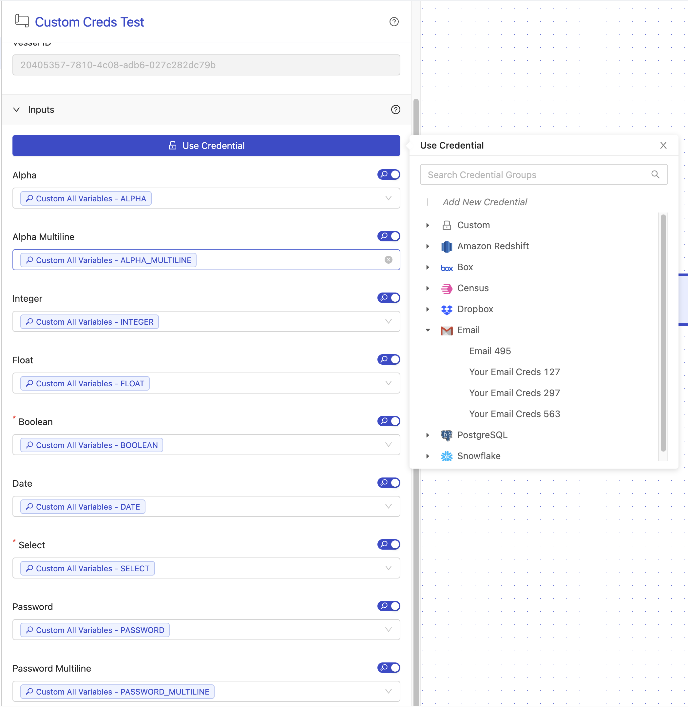

# Credentials

## Definition

Credentials are a way to securely store information at the organization level that can be dynamically accessed by a Vessel at runtime. This can be anything from username and password combinations to API Keys.

Credentials are broken up into two components, **Credential Groups** and **Credential Items**.
- **Credential Groups** are a group of one or more credential items. They can either be created from a pre-defined template related to a specific vendor or they can be Custom.
  - **Predefined Template** Credential Groups can only be used with their respective Library Blueprints. For example, a Snowflake Credential Group can only be used with [Snowflake Blueprints](../blueprint-library/snowflake/snowflake-overview.md). These predefined templates can only be created by Platform staff and should correspond to all vendors that Library Blueprints that have been built for.
  - **Custom** Credential Groups can be used with any Vessel, regardless of if it's built with Code, a Library Blueprint, or a Custom Blueprint. You can add or remove credential items from custom credential groups at any time.
- **Credential Items** are a unique pair of a key and value that live in a Credential Group. They behave exactly like [environment variables](environment-variables/environment-variables-overview.md). A Credential Group cannot have two credential items with the same key.

### Creating Credentials
Credentials can be created in three places in the application:
- From the credentials page after clicking **Add Credential Group**.
- From a specific predefined template page after clicking **Add Credential Group**.
- From the Fleet builder, after selecting "Use Credential" then **Add New Credential**.

When initially creating a credential group, the name of the credential group can be edited. The name is turned into a reference name automatically that lives in ALL_CAPS and removes special characters. After saving a credential group, the name cannot be edited - so name things wisely!

### Updating Credentials
Credentials can always be edited after the fact. While the credential item value can be updated, the key cannot. When a credential item value is updated, the new value will be used by every Vessel that uses or references that credential item.

:::warning
If you remove a Credential Group or Credential Item that is being referenced in multiple places, the value will just be returned as an empty string.
:::

### Using Credentials

#### Blueprint Vessels

When building a Vessel with a Blueprint, there will be a **Use Credential** button under the Inputs tab. Clicking this option and selecting a credential group will fill the input section with all credential items whose keys can be mapped to the Blueprint's [input reference names](inputs.md#reference-name). These reference names can be found on the documentation page for each Library Blueprint. If no matches can be found, a notice will be shown.

For every match that is found, the input switch fill be flipped to the "on" state to indicate that a credential item is actively being used. Additionally, you'll see the credential group and credential item key be shown as a purple tag.

If you need to mix and match credentials, you can also add credential items line by line by flipping the switch to "on" manually and selecting the credential item to associate with that field. In this way, it is possible to combine credential items from multiple credential groups on one Vessel.

#### Code Vessels
When building a Vessel with code, there will be a **Use Credential** button under the Environment Variables tab. Clicking this option and selecting a credential group will fill the entire environment variable section with the associated credential items. This will display as environment variable keys being that are the same as the credential item keys and the environment variable values will fill with the credential item reference syntax (below).

:::warning
If you try to use a Predefined Credential Group on a Code Vessel, the value will be returned as `CREDENTIAL_PREDEFINED_GROUP_NOT_IN_LIBRARY_BLUEPRINT`. This is a safety feature to prevent your users from being able to write scripts that print out credentials for commonly used data tools.
:::

### Referencing Credentials
In the application, credentials can be referenced with the following reference syntax: `#{CREDENTIAL_GROUP_REFERENCE_NAME.CREDENTIAL_ITEM_KEY}`. For example, the following references would correspond to the credential group in the screenshot.
- `#{SNOWFLAKE_PROD.SNOWFLAKE_USERNAME}`
- `#{SNOWFLAKE_PROD.SNOWFLAKE_PASSWORD}`
- `#{SNOWFLAKE_PROD.SNOWFLAKE_ACCOUNT}`
 

## Screenshots
**Credential Overview**

**Predefined Credential Template Overview**

**Using Credentials**

## Additional Notes
1. Each input for a Vessel built with a Blueprint can only have a single credential item associated to it.
2. There is currently no way to see where credentials are being used, so be careful when deleting them.
3. There are currently no access controls related to credentials. Every credential can be used by every member of the organization.
