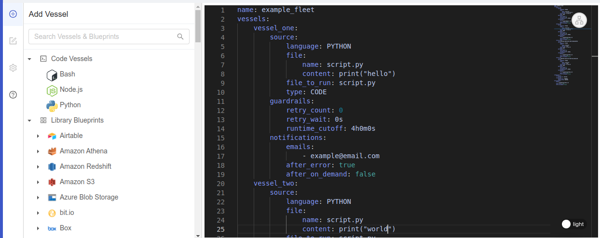
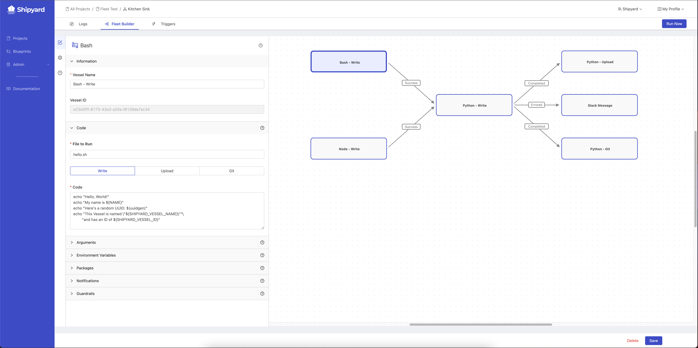

# Fleets

## Definition

A Fleet is a collection of multiple Vessels working together to tackle one larger job. Fleets are the equivalent of a Workflow or DAG in other orchestration tools.

Fleets can contain any number of Vessels and contain any different type of Vessels \(including a mixture of programming languages and Blueprints\). Vessels can be reused across multiple Fleets and can continue to run independently of the Fleets they belong to.

Vessels are connected together with paths which check for the final status of the Vessel they are attached to. While success is checked for by default, the following statuses can be checked for:

- **Success** \(exit code 0\)
- **Errored** \(exit code 1-255\)
- **Completed** \(any exit code\)

### How Fleets Run

Vessels in a Fleet get run in the order that you choose, starting with one or multiple Vessels that don't have any paths feeding into them. A Fleet can be kicked off with a [Schedule Trigger](triggers/schedule-triggers.md), a [Webhook Trigger](triggers/webhook-triggers.md) or an [On Demand Trigger](triggers/on-demand-triggers.md).

The paths between Vessels can be sequential \(one-to-one\), branching \(one-to-many\), converging \(many-to-one\) or any combination of those options.

When an upstream Vessel finishes running, it returns a [status code](other-functions/status.md) to indicate if the Vessel was successful \(exit code of 0\) or if it errored \(exit code of 1-255\). All paths coming out of the finished Vessel are immediately evaluated. If a path evaluates as true, it kicks off all downstream Vessels that are connected to it. If a path evaluates as false, it marks all downstream Vessels as incomplete.

If a Vessel is part of a converging path, it waits until all upstream Vessels have completed. At this point, every upstream Vessel is evaluated to see if the status matches the path condition. If all paths evaluate as true, the downstream Vessel will begin running. If any of the converging paths are evaluated as false, the downstream Vessel will not run.

### File Sharing

When a Fleet runs, it creates a temporary local file store. Files generated by upstream Vessels will be available to every downstream Vessel. Files can only be accessed by other Vessels within the current Fleet run. If the same Fleet is run twice or more in parallel, each instance will have it's own separate file store.

This design is the equivalent of running individual scripts one after another on your local computer. Creating two files with the same name in a Fleet will result in the most recent file overwriting the oldest file.

By default, all files generated are stored in the home directory, `/home/shipyard/` and all scripts are run from this same directory. To access any generated files, you do not need to include the home directory. However, if you have chosen to create a file in a subdirectory, that subdirectory structure must be included to access a file. To see a list of all files available in a Fleet, [follow this guide](../how-tos/fleets/see-all-files.md).

Once every Vessel in the Fleet has finished running, all files are immediately wiped from the Shipyard platform.

This setup allows Vessels to be built to run independent, modular tasks off of newly generated data without needing to change business logic to upload/download files to/from an external storage solution. This setup allows greater flexibility in how you build Vessels and less coding overall when building out your workflows.

### Visual Editor

The Visual editor for Fleets, located on the Fleet Builder tab, allows you to add, edit, and remove Vessels and Paths. This editor was designed to be an intuitive drag-and-drop mechanism to visualize and create complex solutions all in the same location.

For information about how to use the visual editor, click the the question mark icon on the left sidebar.

#### Usage Instructions

- **Click** on the plus icon then select a language or Blueprint option to add a Vessel to the canvas.
- **Click** on a Vessel name to change the underlying Vessel.
- **Click & Drag** on a Vessel to move it.
- **Hover** over a Vessel to reveal the delete button and the new path button.
- **Click & Drag** from the new path button to another Vessel to create a path.
- **Hover** over a path to reveal the delete button.
- **Click** on a path to change the condition to Success, Errored, or Completed.
- **Click & Drag** on the Canvas to re-position your view of Vessels.
- **Ctrl & Scroll** on the Canvas to zoom in and out.
- **Click** on a Vessel shape to edit.
- **Click** on the cog icon to edit Fleet settings.

#### Adding Vessels

When you click on the canvas, or on the sidebar with the `+` icon, the left pane will update to show Blueprints and Languages that you can add/create Vessels with.

This section is split into 3 parts:
- [Code Vessels](code/code-overview.md)

- [Library Blueprints](blueprint-library/blueprint-library-overview.md)

- [Org Blueprints](blueprints.md)

Clicking the Blueprint/Language you want to use will result in a new Vessel being added to the canvas. Hovering over a Blueprint/Language will give you more information about how it can be used.

You can always search for a specific Blueprint using the search bar at the top. This will pre-filter the list to what you're looking for.

You can also duplicate existing Vessels by hovering over the Vessel and clicking the copy icon in the top right corner. This option requires that the original Vessel first be saved.

:::note
With our new updated Fleet Builder, you are no longer able to use pre-existing Vessels in a Fleet. We recommend creating all of your new Vessels from the Fleet Builder view.
:::

#### Editing Vessels

When you click on a Vessel, the left pane will update to show the contents of that Vessel. 

If your Vessel is built with a Blueprint, you will see the following panels:

- [Information](settings/information.md)
- [Inputs](inputs/vessel-inputs.md)
- [Notifications](settings/notifications.md)
- [Guardrails](settings/guardrails.md)

If your Vessel is built with Code, you will see the following panels:

- [Information](settings/information.md)
- [Code](code/code-overview.md)
- [Arguments](code/command.md#arguments)
- [Environment Variables](requirements/environment-variables.md)
- [Packages](requirements/external-package-dependencies.md)
- [Notifications](settings/notifications.md)
- [Guardrails](settings/guardrails.md)

Clicking on a panel will either expand or collapse its contents. Each panel can be edited independently and you can switch between multiple panels or multiple Vessels.

During the process of making edits, if any panel's contents are invalid, you will receive an error notification specifying what panel needs to be updated. This error will need to be immediately resolved in order to continue editing. While a panel has errors:
- You will not be able to collapse the affected panel 
- You will not be able to switch tabs on the sidebar
- You will not be able to select another Vessel to edit
- You will not be able to add another Vessel to the Fleet
- You will not be able to change any underlying Vessels

All changes are "soft-saved" as you work in the Fleet Builder. You can make as many edits as you'd like and these changes will be continue to be shown in the UI as long as you don't leave the Fleet Builder tab or refresh the page. Once you're finished making all of your edits, you **must** click the Save button at the bottom to officially save all of your changes.

### YAML Editor

In addition to the graph UI, the Fleet Builder also has a YAML editor to directly edit the Fleet configuration.  The YAML definition follows the Shipyard [FAC specifications](fac.md) - see the documentation for additional information.

In order to access the YAML editor, ensure that your Fleet is saved.

- **Click** "Save" if the option is available
- **Click** the text icon in the top right corner of the graph editor
- **Edit** code in-line
- **Click** "Save" to save your changes

## Screenshots

## Additional Notes

1. A Fleet cannot be set up with Vessels that live across multiple projects. You'll need to make sure that all of the relevant Vessels live within the same project.
2. A Fleet cannot contain any paths that would create a loop.
3. If you want to have a set of Vessels that aren't connected to the larger group, you will need to create a different Fleet.
4. You are currently unable to kick off a Fleet starting anywhere in the middle, although you can kick off individual Vessels at will. This prevention is in place because we delete data as soon as a Fleet has finished running, whether it was successful or not. If you ran a Vessel starting from the middle and it relied on data created upstream, it would be unable to find that data and immediately fail.
5. Each time a Fleet is saved, a version of that Fleet is generated and is accessible in the [Version Control](reference/version-control.md)tab.

## Learn More

- [How to Delete a Fleet](../how-tos/fleets/delete-fleet.md)
- [How to Create a New Fleet](../how-tos/fleets/create-fleet.md)
- [How to Edit a Fleet](../how-tos/fleets/edit-fleet.md)
- [How to Duplicate a Fleet](../how-tos/fleets/duplicate-fleet.md)
- [How to Assess Fleet Performance](../how-tos/fleets/assess-fleet-performance.md)
- [How to See All Available Files in a Fleet](../how-tos/fleets/see-all-files.md)