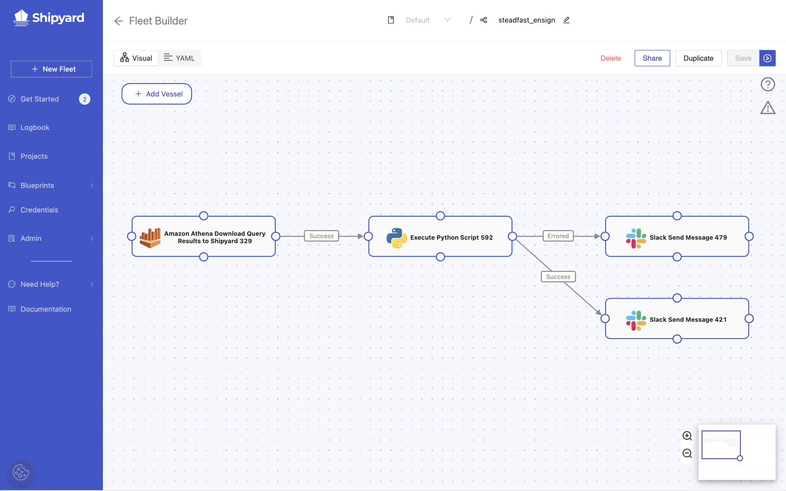

# Fleets Overview

## Definition

A Fleet is a collection of multiple Vessels working together to tackle one larger job. Fleets are the equivalent of a Workflow or DAG in other orchestration tools.

Fleets can contain any number of Vessels and contain any different type of Vessels \(including a mixture of programming languages and Blueprints\). They can be built in either the [Visual Editor](visual-editor.md) or the [YAML Editor](yaml-editor.md), with changes made in one editor synced to the other.

Vessels are connected together with paths which check for the final status of the Vessel they are attached to. While success is checked for by default, the following statuses can be checked for:

- **Success** \(exit code 0\)
- **Errored** \(exit code 1-255\)
- **Completed** \(any exit code\)

### How Fleets Run

Vessels in a Fleet get run in the order that you choose, starting with one or multiple Vessels that don't have any paths feeding into them. A Fleet can be kicked off with a [Schedule Trigger](../triggers/schedule-triggers.md), a [Webhook Trigger](../triggers/webhook-triggers.md) or an [On Demand Trigger](../triggers/on-demand-triggers.md).

The paths between Vessels can be sequential \(one-to-one\), branching \(one-to-many\), converging \(many-to-one\) or any combination of those options.

When an upstream Vessel finishes running, it returns a [status code](../other-functions/status.md) to indicate if the Vessel was successful \(exit code of 0\) or if it errored \(exit code of 1-255\). All paths coming out of the finished Vessel are immediately evaluated using AND logic. If all paths evaluate as true, the platform will kick off all downstream Vessels that are connected. If a path evaluates as false, all downstream Vessels will be marked as incomplete.

If a Vessel is part of a converging path, it waits until all upstream Vessels have completed. At this point, every upstream Vessel is evaluated to see if the status matches the path condition, using AND logic. If all paths evaluate as true, the downstream Vessel will begin running. If any of the converging paths are evaluated as false, the downstream Vessel will not run.

### File Sharing

When a Fleet runs, it creates an ephemeral local file storage. Files generated by upstream Vessels will be available to every downstream Vessel. Files can only be accessed by other Vessels within the current Fleet run. If the same Fleet is run twice or more in parallel, each instance will have it's own separate file storage.

This design is the equivalent of running individual scripts one after another on your local computer. Creating two files with the same name in a Fleet will result in the most recent file overwriting the oldest file.

By default, all files generated are stored in the home directory, `/home/shipyard/` and all scripts are run from this same directory. To access any generated files, you do not need to include the home directory. However, if you have chosen to create a file in a subdirectory, that subdirectory structure must be included to access a file. To see a list of all files available in a Fleet, [follow this guide](../../how-tos/fleets/see-all-files.md).

Once every Vessel in the Fleet has finished running, all files are immediately wiped from the Platform platform.

This setup allows Vessels to be built to run independent, modular tasks off of newly generated data without needing to change business logic to upload/download files to/from an external storage solution. This setup allows greater flexibility in how you build Vessels and less coding overall when building out your workflows.

## Screenshots

## Additional Notes

1. A Fleet cannot contain any paths that would create a loop.
2. If you want to have a set of Vessels that aren't connected to the larger group, you will need to create a different Fleet.
3. There is limited functionality for kicking off a Fleet starting anywhere in the middle. This prevention is in place because we delete data as soon as a Fleet has finished running, whether it was successful or not. If you ran a Vessel starting from the middle and it relied on data created upstream, it would be unable to find that data and immediately fail. That said, a Fleet can be kicked off starting in the middle with a few caveats. To learn more about how to accomplish this action, go here: [How to Kick off a Fleet in the Middle](../../how-tos/fleets/kick-off-a-fleet-in-the-middle.md)
4. Each time a Fleet is saved, a version of that Fleet is generated and is accessible in the [Version Control](version-control.md) tab.

## Learn More

- [How to Delete a Fleet](../../how-tos/fleets/delete-fleet.md)
- [How to Create a New Fleet](../../how-tos/fleets/create-fleet.md)
- [How to Edit a Fleet](../../how-tos/fleets/edit-fleet.md)
- [How to Duplicate a Fleet](../../how-tos/fleets/duplicate-fleet.md)
- [How to Run a Fleet with Parameters](../../how-tos/fleets/run-with-params.md)
- [How to Assess Fleet Performance](../../how-tos/fleets/assess-fleet-performance.md)
- [How to See All Available Files in a Fleet](../../how-tos/fleets/see-all-files.md)
- [How to Kick off a Fleet in the Middle](../../how-tos/fleets/kick-off-a-fleet-in-the-middle.md)
