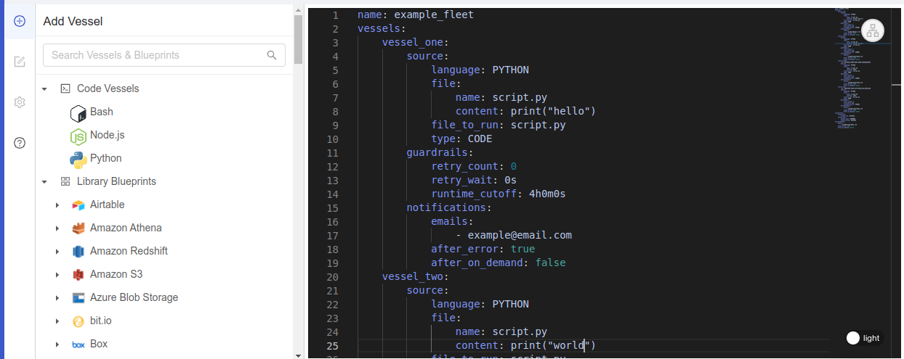
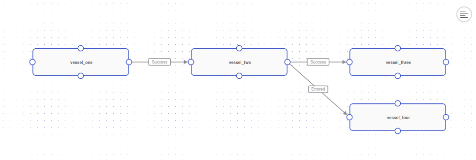

import Tabs from '@theme/Tabs';
import TabItem from '@theme/TabItem';

# YAML Editor

## Definition

In addition to the Visual editor, the Fleet Builder also has a YAML editor to directly edit the Fleet configuration. This system allows for users to take a more code-based approach to constructing their workflow definitions. Additionally, it makes it easier for users to share their configured workflows with teammates and other developers.

In order to access the YAML editor, ensure that your Fleet is saved.

- **Click** "Save" if the option is available
- **Click** the text icon in the top right corner of the Visual editor
- **Edit** code in-line
- **Click** "Save" to save your changes



## YAML Specification

Below are the top-level fields that make up a FAC YAML file. Sub-objects are defined beneath these as needed.

---

### name

`name` is the string name of the Fleet. It is a **required** field.

If both a `name` and `_id` field are provided at the top-level of the file, Shipyard will attempt to update a Fleet with that `_id` value with the `name` field.

---

### _id

`_id` is an optional top-level value representing the ID of an existing Fleet. If provivded, Shipyard will attempt to look it up and apply the FAC YAML as an update to the Fleet.

If the ID value does _not_ exist, Shipyard will attempt to create a new Fleet with the information provided.

---

### vessels

`vessels` represents the [Vessels](../vessels.md) that constitute the Fleet. Keys represent the name of the Vessel and must be unique within the Fleet object. Values are the Vessel definition represented as a YAML object which may be code-based, Blueprint-based, or Git-based.

Vessels may have a `_id` top-level field.

```yaml
long_vessel_name:
  _id: example_uuid
```

If `_id` is provided, Shipyard will attempt to find and update the Vessel with the provided values.

Below are examples of the three types with accompanying notes on the various fields that go under the `source` field.

<Tabs
groupId="sourceCodeTypes"
defaultValue="code"
values={[
{label: 'Code', value: 'code'},
{label: 'Blueprint', value: 'blueprint'},
{label: 'Git', value: 'git'},
]}>
<TabItem value="code">

```yaml
source:
  type: CODE
  language: PYTHON
  version: "3.9"
  file:
    name: script.py
    content: |
      for i in range(10):
        print(i)
  file_to_run: script.py
```

- `language` may be one of `PYTHON`, `BASH`, or `NODE`
- `name` is a string represented the file name containing the code
- `content` is a string or multiline string containing the code
- `file_to_run` indicates the file to run that contains the Vessel code - for a `CODE` Vessel type, this is likely the same as `name` above

</TabItem>
<TabItem value="blueprint">

```yaml
source:
  type: BLUEPRINT
  blueprint: "Email - Send Message"
  inputs:
    EMAIL_SENDER_ADDRESS: example@email.com
...
```

- `blueprint` is the name of the Blueprint created separately from the Fleet - it must match the name exactly and may either be a [Library Blueprint](../blueprints/blueprint-library/blueprint-library-overview.md) or an [Organization Blueprint](../blueprints/blueprints-overview.md)
- `inputs` are a key-value pair representing the [input variable](../inputs.md) name and value
	- the "key" maps to the [Reference Name](../blueprints/org-blueprints/blueprint-variables.md#reference-name) for any Blueprint Input
	- if the Blueprint is configured so that the input is a "password" type, when this FAC is fetched back to the user it will show `SHIPYARD_HIDDEN` to obfuscate the value

</TabItem>
<TabItem value="git">

```yaml
source:
  type: CODE
  language: PYTHON
  version: "3.9"
  git:
    repository: owner/repo
    checkout_point: master
    clone_location: REPO_NAME
  file_to_run: script.py
```

- `repository` is a string representing the GitHub repository owner and name
- `checkout_point` is a string representing the branch or tag to checkout
- `clone_location` indicates where to download the repo to and may either be `REPO_NAME` or `CWD`
- `file_to_run` is a string representing the file to for any Vessel type that requires it
- see [Git connections](../code/git-connection.md) for more information

</TabItem>
</Tabs>

In addition to these code source-specific objects, there the standard requirements configurations common to all Vessels are also available within the `source` field. _These are all optional_. Any combination of these fields may be provided.

`arguments`

```yaml
source:
  ...
  arguments:
    - key: example_key_1
      value: example_value_1
	- { key: example_key_2, value: example_value_2 }
```

`environment`

```yaml
source:
  ...
  environment:
    - name: variable_name_1
      value: variable_value_1
	- { name: variable_name_2, value: variable_value_2 }
```

See [Environment Variables](../environment-variables/environment-variables-overview.md) for more information

`packages`

```yaml
source:
  ...
  packages:
    - name: example_package
	  version: '==1.0.0'
```

- `version` is an optional string value

See [Packages](../packages/external-package-dependencies.md) for more information.


`system_packages`

```yaml
source:
  ...
  system_packages:
    - name: example_package
```

These are the same structure as `packages` above and are available for `PYTHON` and `NODE` Vessel types only. See [System Packages](../packages/system-package-dependencies.md) for more information

Additionally, there are optional [Guardrail](../guardrails.md) and [Notification](../notifications.md) settings available for Vessel objects. These both live at the same level as the `source` field. See below for examples.

`guardrails`

```yaml
vessel_name:
  ...
  guardrails:
    retry_count: 3
    retry_wait: 5m0s
    runtime_cutoff: 15m0s
    exclude_exit_code_ranges:
      - 2
	  - '3-5'
```

- `retry_count` is an integer representing the number of times to retry a Vessel if it fails (max of 24)
- `retry_wait` is a string representing the amount of time to wait between retries (max of 1h) - the example above indicates a retry wait of 5 minutes
- `runtime_cutoff` is a string representing the amount of time to wait before killing a Vessel (max of 4h) - the example above indicates a runtime cutoff of 15 minutes
- `exclude_exit_code_ranges` is an array of values (integers or strings formated at "N-N") representing the exit codes to exclude from the Vessel's exit code range - the example above indicates that exit codes `2`, `3`, `4`, and `5` should be excluded

Formatting for `retry_wait` and `runtime_cutoff` follow a "#h#m#s" format for hours, minutes, and seconds. These values must be divisible by 5 minute increments.

`notifications`

```yaml
vessel_name:
  ...
  notifications:
    emails:
      - example@email.com
      - another@email.com
    after_error: true
    after_on_demand: false
```

- `emails` is an array of email addresses to send notifications to
- `after_error` is a boolean indicating whether to send a notification after a Vessel after a Vessel completes with a [status](../other-functions/status.md) of Errored
- `after_on_demand` is a boolean indicating whether to send a notification after a Vessel is run on demand

---

### connections

`connections` is a top-level field that defines how the Vessels, defined in the `vessels` section, are connected together.

Each key in the object is a Vessel name value (if provided) representing the "from" Vessel and the value is an object that contains the "to" Vessel(s) and the connection type. See below for an example.

```yaml
connections:
  vessel_one:
    vessel_two: SUCCESS
  vessel_two:
    vessel_three: SUCCESS
    vessel_four: ERRORED
```

This example indicates that if `vessel_one` succeeds, it will invoke `vessel_two` and if `vessel_two` succeeds, it will invoke `vessel_three`. If `vessel_two` fails, it will invoke `vessel_four`.

Below is what the YAML configuration above would look like in the Visual editor.



See [Fleets](fleets-overview.md) documentation for more information on connections.

---

### triggers

Currently, the triggers supported in FAC are [Schedules](../triggers/schedule-triggers.md). These are defined as an array of objects under the `schedules` field. See below for an example.

```yaml
triggers:
  schedules:
    - how_often: HOURLY
      at: ':00'
    - how_often: DAILY
      at: '2:00'
    - how_often: WEEKLY
      at: '3:00'
      when: WEDNESDAY
    - how_often: MONTHLY
      at: '22:00'
      when: 1
```

In these examples there are four schedules set on the Fleet. Note that the times are represented in 24-hour format.

1. running hourly on the hour
2. running daily at 2:00 AM
3. running weekly on Wednesday at 3:00 AM
4. running monthly on the 1st at 10:00 PM

---

### notifications

This is the same object available under the Vessels `notifications` field. If configured, this will emit notifications based on actions of the full Fleet.

```yaml
notifications:
  emails:
    - example@email.com
    - another@email.com
  after_error: true
  after_on_demand: false
```

## Examples and Templates

Below is a full example FAC file.

:::note
Right now, comments will **not** be saved or rendered whenever the Fleet is saved and refreshed. This is because the YAML is generated based on the inputs available in the Visual Editor rather than stored in a file. This will be addressed in a future release.
:::

```yaml
name: Example Fleet
vessels:
    FirstVessel:
        source: # source holds all Vessel-code related resources
            type: CODE # (required) "CODE" or "BLUEPRINT" values allowed
            language: PYTHON # (required) "PYTHON", "NODE", or "BASH" values allowed
            # name and content define the file holding "CODE" Vessel code to execute
            # multiline strings are supported using the YAML "|" syntax
            version: "3.9" # (optional) "3.7" or "3.9" allowed.
            # If not included, will use the latest version of the language.
            file:
                name: script.py 
                content: |
                    import os
                    import argparse

                    parser = argparse.ArgumentParser()
                    parser.add_argument('--example_arg')

                    print('hello, world!')
                    print(parser.parse_args())
					print(os.environ['example_name_a'])
            file_to_run: script.py # this generally maps to the name field above
            # arguments are fed in as command line arguments to the script
            # see the two formatting methods for the array below
			arguments:
                - '--example_arg': example_value
                - { name: example_arg, value: example_value }
            # environment represents environment variables made available to the script
            # see the two formatting methods for the array below
            environment:
                - name: example_name_a
                  value: example_value_a
                - { name: example_name_b, value: example_value_b }
        guardrails:
            retry_count: 1 # (optional) max of 24
            retry_wait: 5m # (optional) max of 1h and must be divisible by 5 minutes
            runtime_cutoff: 10m # (optional) max of 4h and must be divisible by 5 minutes
            exclude_exit_code_ranges:
                - 2
	            - '3-5'
    SecondVessel:
        source:
            type: BLUEPRINT
            blueprint: 'Example Blueprint'
            inputs:
                FIRST_INPUT: 'blueprint input value'
    ## Paste this code under 'vessels' and then connect it to other vessels under 'connections'
    'ambitious_sail':
        source:
            type: BLUEPRINT
            blueprint: 'Email - Send Message'
            inputs: 
                'EMAIL_SEND_METHOD': 'tls' # (required) determines how email is sent - TLS is recommended
                'EMAIL_SMTP_HOST': # (required) server where your email will be sent from - usually formatted "smtp.domain.com"
                'EMAIL_SMTP_PORT': # (required) port to send from - 587 is recommended with TLS
                'EMAIL_USERNAME': # (required) username of the address to send from 
                'EMAIL_PASSWORD': 'hlgyecgskabctidf' # (required) password for the "sender address"
                'EMAIL_SENDER_ADDRESS': # (required) email address to send from
                'EMAIL_SENDER_NAME': # (optional) name of the sender which defaults to the "sender email" if left blank
                'EMAIL_TO': # (optional) emails to send to - formatted as a comma-separated list e.g. first@email.com,second@email.com
                'EMAIL_CC': # (optional) emails to CC - formatted as a comma-separated list e.g. third@email.com,fourth@email.com
                'EMAIL_BCC': # (optional) emails to CC - formatted as a comma-separated list e.g. fifth@email.com,sixth@email.com
                'EMAIL_SUBJECT': # (optional) subject of the email
                'EMAIL_MESSAGE': # (required) body of the email
                'EMAIL_INCLUDE_SHIPYARD_FOOTER': true # (required) determines whether to send emails with links back to the originating Vessel or Fleet
connections:
    FirstVessel:
        SecondVessel: SUCCESS # (required) valid options are "SUCCESS", "ERRORED", or "COMPLETED"
triggers:
    schedules:
        - how_often: HOURLY
          at: ':25'
notifications:
    emails:
	    # - example@email.com (remove when using this example)
        # - (add your email here)
    after_error: true
    after_on_demand: false
```
