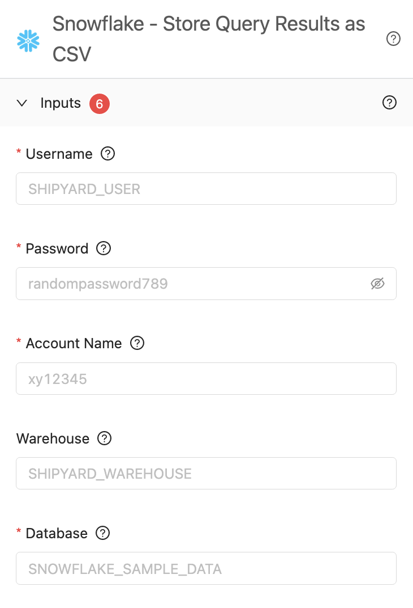

# Inputs

## Definition

The Inputs panel is found when editing or creating a Vessel built with a Blueprint. 

The inputs are a direct reflection of the [Blueprint Variables](blueprints/org-blueprints/blueprint-variables.md) that are set up for the selected [Blueprint](blueprints/blueprints-overview.md).

These fields allow a user to input data that a script uses, without the need to code.

Input fields are validated to ensure that the input matches the expected [variable type](blueprints/org-blueprints/blueprint-variables.md#variable-type). You cannot proceed with building a Vessel until all required inputs are correctly filled out.

## Screenshots

