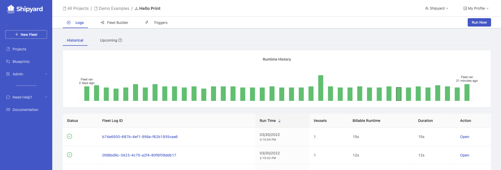
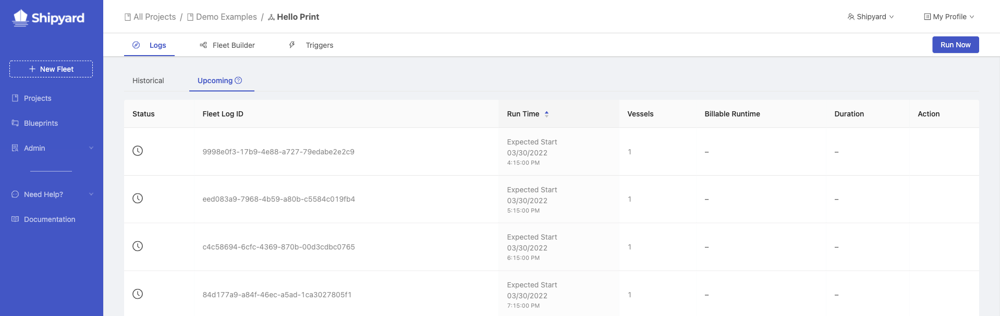

# Fleet Logs

## Definition

The Logs tab of a Fleet shows two lists: historical and upcoming. 
- The Historical tab shows a list of each unique log of every Fleet Voyage or run that has occurred, alongside additional metadata and graphs around performance. 
- The Upcoming tab shows a list of scheduled runs for the Fleet. By clicking on an ID or the Open action, you can view more information.

The graph on the Fleet Logs Historical tab shows historical run durations trended out for all logs shown on the current page.

### Individual Fleet Log

The graph on the individual Fleet Log page shows a Gantt chart view of the order and length of time that each Vessel in the fleet ran for.

The table below shows all of the [Vessel Logs](vessel-logs.md) that were created and run as a part of the current Fleet. You can view more information about the individual Vessel Log by clicking on the ID.

### Live Update

In the **Overview** tab, if a log has a status of *Scheduled* or *Running*, the individual Log page will automatically refresh every few seconds to show:

- Current Fleet Status
- Current Duration
- Live Gantt Chart Updates

While the Fleet is actively running, you can click into an Individual [Vessel Log](vessel-logs.md) that's currently running and click **Stop Voyage** to terminate the voyage, thus terminating all downstream Vessels in the Fleet.

Once the Fleet has finished running, the page will no longer automatically refresh.

### Webhook Parameters

In the **Webhook Parameters** tab, you can see the parameters that may have been conditionally sent via a webhook trigger. There are no values in this tab if the Fleet is triggered manually or via a schedule.

The content will be rendered as a JSON object in the UI with two optional fields:

- `headers_content`: this contains any key-value pairs that may have been sent as headers in the webhook trigger
- `body_content`: this contains the full payload in whatever format it was received in the webhook trigger

These values can be accessed as files via the [platform environment variables](../environment-variables/environment-variables-overview.md) of `SHIPYARD_WEBHOOK_HEADERS_FILE` and `SHIPYARD_WEBHOOK_BODY_FILE` that hold the path to each file which looks like `/home/shipyard/<voyage_id>.webhook_headers` and `/home/shipyard/<voyage_id>.webhook_body`, respectively.

The **headers** file is stored as JSON and the **body** file is stored in the same format it was received (e.g. JSON, YAML, etc.).

### Metadata

| Name                                                       | Definition                                                              |
| :--------------------------------------------------------- | :---------------------------------------------------------------------- |
| **Fleet Log ID**                                                 | UUIDv4 associated with the individual Fleet run.                              |
| [**Status**](../other-functions/status.md) | The last known information about a run.                                 |
| [**Trigger**](../triggers/triggers-overview.md)                | What type of Trigger generated this log.                                |
| **Vessels**                                                | The number of Vessels connected in the current run of the Fleet.                                |
| **Billable Runtime**                                               | The cumulative runtime of all Vessels in the Fleet that is billable.                      |
| **Duration**                                               | The total length of time that the Fleet ran for.                       |
| **Start Time**                                             | The timestamp of when the run started.                         |
| **End Time**                                               | The timestamp of when the run ended.                                    |

## Screenshots

## Additional Notes

1. If a Fleet runs into an error and can't finish, any Vessel Logs that were scheduled but not run are marked as incomplete with links disabled.
2. The table of Vessel Logs isn't guaranteed to show the Vessels in the order that they ran.
