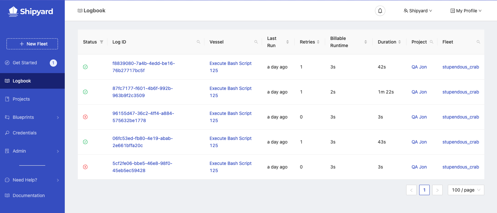

# Logbook

## Definition

:::note
This is a new feature that we are currently testing to provide users with greater insight into performance across the application. If you have any feedback to make this page more useful for you, please let us know!
:::

The Logbook tab on the sidebar shows a live feed of logs for all Vessels that are either currently running or have completed running within the last 24 hours. Each user is only able to see the logs that can be found in Projects they have access to.

### Metadata

| Name                                                       | Definition                                                              |
| :--------------------------------------------------------- | :---------------------------------------------------------------------- |
| [**Status**](../other-functions/status.md) | The last known information about a run.                                 |
| **Vessel Log ID**                                                 | UUIDv4 associated with the individual Vessel run.                              |
| **Vessel**                                                 | The name of the Vessel.                              |
| **Last Run**                                                 | How recently the Vessel ran. Hover for the full timestamp.                              |
| **Retries**                                                 | The number of times that the Vessel retried before achieving the listed status.                             |
| **Billable Runtime**                                               | The cumulative runtime of all Vessels in the Fleet that is billable.                      |
| **Duration**                                               | The total length of time that the Fleet ran for.                       |
| **Project**                                                 | The name of the Project.                              |
| **Fleet**                                                 | The name of the Fleet.                              |

## Screenshots

## Additional Notes

1. This view is not currently auto-updated. You will need to refresh the page to see new logs.
2. This view does not currently show the overall status of the Fleet.
