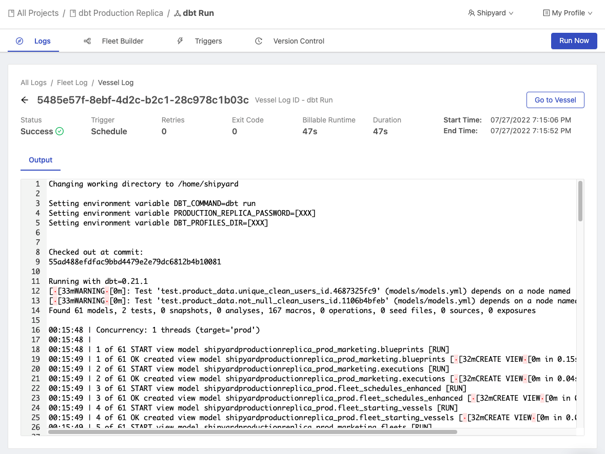

# Vessel Logs

## Definition

Every [Fleet Log](fleet-logs.md) shows a list of each unique Vessel log generated by the Fleet's voyage. By clicking on an ID, you can view more information.

### Output

The output section of an individual Vessel Log will show you:

- Any [environment variables](../environment-variables/environment-variables-overview.md) that were set via the Requirements tab or via [inputs](../inputs.md).
- If using a [Git Connection](../code/git-connection.md), the commit hash of the code that was cloned.
- Platform functionality, such as downloading your script and changing the current working directory.
- Any data that your script printed to `stdout`.

### Live Update

If a log has a status of *Scheduled* or *Running*, the individual Log page will automatically refresh every few seconds to show:

- Current Vessel Status
- Current Duration
- Live Output

While the Vessel is actively running, you can click **Stop Voyage** to immediately terminate the job.

Once the Vessel has finished running, the page will no longer automatically refresh.

### Metadata

| Name                                                       | Definition                                                              |
| :--------------------------------------------------------- | :---------------------------------------------------------------------- |
| **Vessel Log ID**                                                 | UUIDv4 associated with the individual Vessel run.                              |
| [**Status**](../other-functions/status.md) | The last known information about a run.                                 |
| [**Trigger**](../triggers/triggers-overview.md)                | What type of Trigger generated this log.                                |
| **Retries**                                                | The number of times the run was retried.                                |
| **Exit Code**                                              | The exit code that the script returned upon completion.                 |
| **Billable Runtime**                                               | The cumulative runtime of the Vessel that is billable.                      |
| **Duration**                                               | The total length of time that the Vessel ran for.                       |
| **Start Time**                                             | The timestamp of when the run started.                         |
| **End Time**                                               | The timestamp of when the run ended.                                    |

## Screenshots

## Additional Notes

1. The Log Output does not contain any information pertaining to the process of installing [external package dependencies](../packages/external-package-dependencies.md)
2. The Live Update feature of the Log Output only updates every time there are 256 additional bytes of data. In some instances where very little data is sent to the output, it may look like the Vessel is not actually showing any new data.
