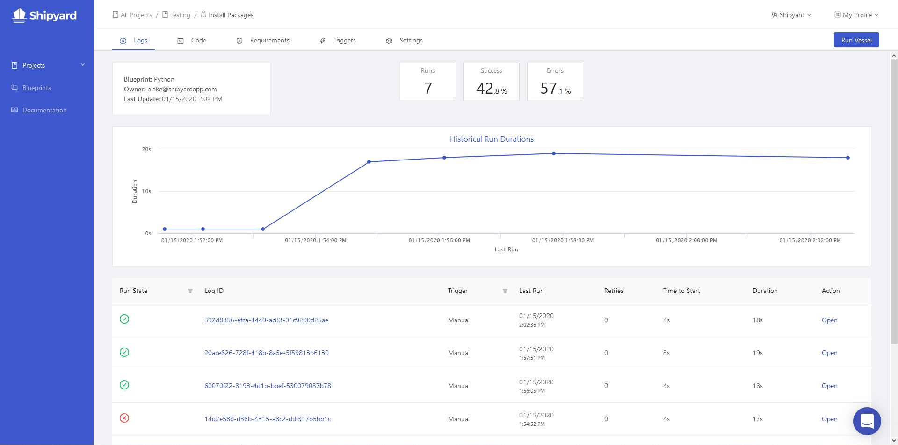
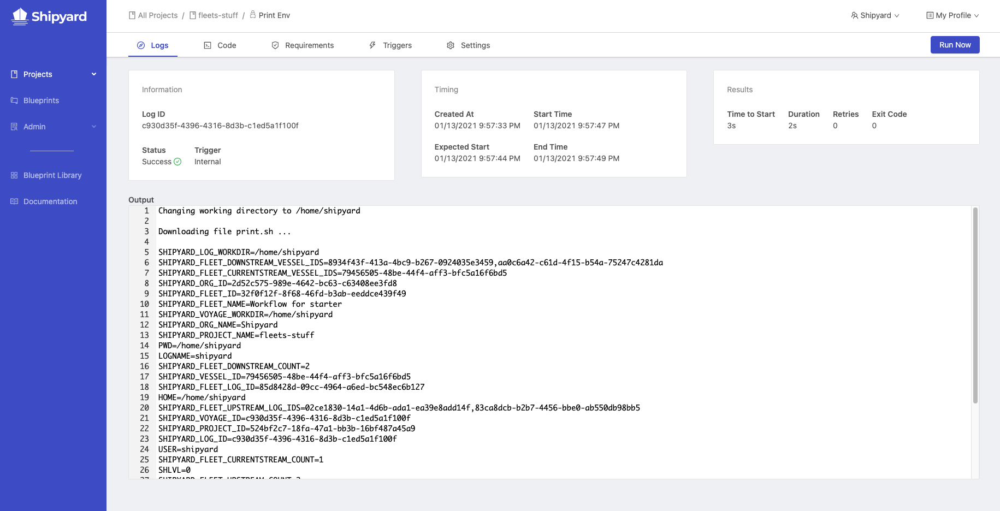

# Vessel Logs

## Definition

The Logs tab of a Vessel shows a list of each unique log of every Voyage or run that has occurred, alongside additional metadata and graphs around performance. By clicking on an ID or the Open action, you can view more information.

The graph on the Vessel Logs tab shows historical run durations trended out for all logs shown on the current page. The scorecards at the top give a high-level insight into how successfully your Vessel has been running historically.

### Output

The output section of an individual Vessel Log will show you:

- Any [environment variables](../requirements/environment-variables.md) that were set via the Requirements tab or via [Blueprint Variable](../inputs/blueprint-variables.md) inputs.
- If using a [Git Connection](../code/git-connection.md), the commit hash of the code that was cloned.
- Shipyard functionality, such as downloading your script and changing the current working directory.
- Any data that your script printed to `stdout`.

### Live Update

If a log has a status of *Scheduled* or *Running*, the individual Log page will automatically refresh every few seconds to show:

- Current Vessel Status
- Current Duration
- Live Output

While the Vessel is actively running, you can click **Stop Voyage** to immediately terminate the job.

Once the Vessel has finished running, the page will no longer automatically refresh.

### Metadata

| Name                                                       | Definition                                                              |
| :--------------------------------------------------------- | :---------------------------------------------------------------------- |
| [**Status**](../other-functions/status.md) | The last known information about a run.                                 |
| **Log ID**                                                 | UUIDv4 associated with the individual run.                              |
| [**Trigger**](../triggers/README.md)                | What type of Trigger generated this log.                                |
| [**Blueprint** ](../blueprints.md)                                             | The Blueprint that the Vessel is built from.                            |
| **Created At**                                             | The timestamp of when the run was originally scheduled within Shipyard. |
| **Expected Start**                                         | The timestamp of when the run was scheduled to start.                   |
| **Start Time**                                             | The timestamp of when the run actually started.                         |
| **End Time**                                               | The timestamp of when the run ended.                                    |
| **Time to Start**                                          | The duration between the Expected Start and the Start Time              |
| **Duration**                                               | The total length of time that the Vessel ran for.                       |
| **Retries**                                                | The number of times the run was retried.                                |
| **Exit Code**                                              | The exit code that the script returned upon completion.                 |

## Screenshots

## Additional Notes

1. Logs cannot currently be exported from Shipyard for analysis. If you need access to this data, reach out to [support](mailto:support@shipyardapp.com).
2. The Log Output does not contain any information pertaining to the process of installing [external package dependencies](../requirements/external-package-dependencies.md).
3. The Live Update feature of the Log Output only updates every time there are 256 additional bytes of data. In some instances where very little data is sent to the output, it may look like the Vessel is not actually showing any new data.
