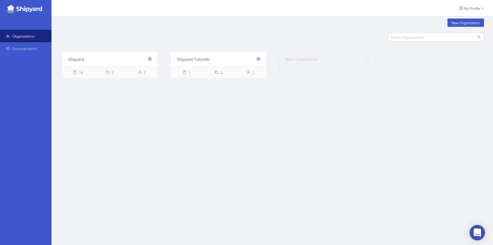

# Organizations

## Definition

An organization is the highest level structure that exists within Platform. It has admin users, contains user management controls, and houses multiple projects. While called an organization, it can be used by an individual or smaller team units at a business.

## Screenshots

## Additional Notes

1. An email can belong to multiple organizations if it is invited to them. However, a single email cannot initially make more than one organization.
