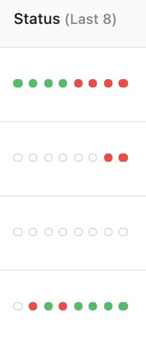

# Status

## Definition

**Status** refers to the final outcome of a single run for a Vessel or Fleet, tied to an individual [log](../logs/logs-overview.md).

### Status Column
The Status column for Vessels and Fleets will show the last 8 completed statuses so you can assess performance at a glance. This column will never show scheduled, running, or retrying statuses. The last 8 statuses should be read from left-to-right, with the right-most circle indicating the most recent status.

- A green circle indicates a status of Success.
- A red circle indicates a status of Errored or Terminated.
- A white circle with a grey border indicates a lack of data. This only occurs when the Vessel or Fleet has less than 8 runs in total.

### Vessel Statuses
The following statuses are possible for Vessels:

| Name           | Icon |Definition                                                                                                                    |
| :------------- |:----- |:---------------------------------------------------------------------------------------------------------------------------- |
| **Success**    |  | This run completed with an exit code of 0.                                                                                    |
| **Errored**    | | This run completed with an exit code from 1 to 255.                                                                           |
| **Terminated** | | This run was manually stopped by a user.                                                                                      |        |
| **Retrying**   |  | This run has previously errored and is running again based on options selected in the Guardrails.                              |
| **Running**    |  | This run is currently occuring.                                                                                               |
| **Scheduled**  |  | This run has not yet occurred, but is scheduled to occur in the next 24 hours                                                 |
| **Incomplete** |  | This run will never occur. This status can only be seen on Fleet logs, when upstream Vessels failed to take a branching path. |

### Fleet Statuses
The following statuses are possible for Fleets:

| Name           | Icon |Definition                                                                                                                    |
| :------------- |:----- |:---------------------------------------------------------------------------------------------------------------------------- |
| **Success**    |  | Every Vessel in this Fleet that ran resulted in a final status of Success.                                                                                    |
| **Errored**    | | One or more Vessels in this Fleet that ran resulted in a final status of Errored.     This status occurs even if an error path was intentional, as error pathing typically indicates a resolution process for something that went wrong.
| **Terminated** | | One or more Vessels in this Fleet were manually stopped by a user.                                                                                      |        
| **Running**    |  | One or more Vessels in this Fleet are still actively running.                                                                                             |
| **Scheduled**  |  | This Fleet has been scheduled to run in the next 24 hours.                                                 |