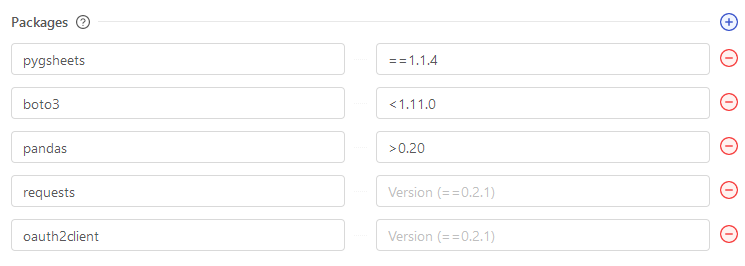
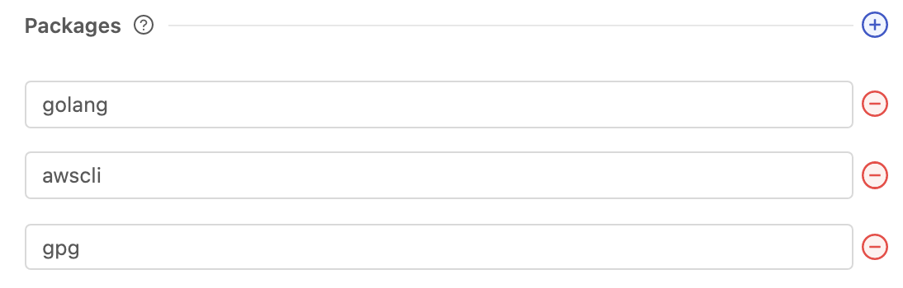

import Tabs from '@theme/Tabs';
import TabItem from '@theme/TabItem';

# External Package Dependencies

## Definition

Every language that Platform supports has packages that can be installed to enhance the functionality and simplicity of your scripts. If your script uses an external package, you'll have to tell Platform what packages to install before the script can run successfully.

There are 2 options in the platform for installing packages. How you enter this information varies by language. 

:::tip Pro Tip
If you're uploading code directly to Platform, we recommend installing packages using the Packages Panel so that team members can quickly view and change the version.

If you're using a Git connection, we recommend including a packages file in the root directory of your repository. Platform will automatically find this file and install dependencies.
:::
:::warning
You must choose one option or the other. Using both simultaneously will result in packages not being installed properly.
:::

## Setup
### Option 1 - Use the Packages Panel

<Tabs
groupId="languages"
defaultValue="python"
values={[
{label: 'Python', value: 'python'},
{label: 'Bash', value: 'bash'},
{label: 'Node', value: 'node'},
]}>
<TabItem value="python">

When you build a Vessel or Blueprint with Python, it comes with the latest version of pip pre-installed, allowing you to easily install python package dependencies. These packages can be listed out under the Python Packages Panel.

Packages should be formatted with the Package Name field filled out. Optionally, you can include a version for each package name that you've listed. Versions must be formatted according to [Python standards](https://www.python.org/dev/peps/pep-0440/#version-specifiers).

In order to install public packages from GitHub \(that are not available on PyPi, or for different versions\) you will need to use the git+git scheme with the GitHub URL.

```text
git+git://github.com/pandas-dev/pandas@master
```



</TabItem>
<TabItem value='bash'>

When you build a Vessel or Blueprint with Bash, it runs inside Docker containers running a Debian image. In order for your Vessel to run successfully, you must provide a way to install any Linux packages that you need. These packages can be listed out under the Bash Packages Panel.

Packages should be formatted with the Package Name field filled out. [Use this site](https://www.debian.org/distrib/packages) to find all available packages you can use with Bash in Platform.



</TabItem>
<TabItem value='node'>

The Node.js Code Blueprint comes with the latest version of npm pre-installed, allowing you to easily install Node.js package dependencies. In order for your Vessel to run successfully, you must provide a way to install these packages. These packages can be listed out under the Node Packages Panel.

Packages should be formatted with the Package Name field filled out. Optionally, you can include a version for each package name that you've listed. Versions must be formatted according to [npm standards](https://semver.npmjs.com/).

In order to install public packages from GitHub \(that are not available on npm, or for different versions\) you will need to use the git+git scheme with the GitHub URL.

```text
git+git://github.com:data-forge/data-forge-ts.git
```

</TabItem>
</Tabs>

### Option 2 - Uploading a Packages File

<Tabs
groupId="languages"
defaultValue="python"
values={[
{label: 'Python', value: 'python'},
{label: 'Bash', value: 'bash'},
{label: 'Node', value: 'node'},
]}>
<TabItem value="python">

You can also install package dependencies by including a `requirements.txt` file in any directory of the code you upload. Platform will automatically find this file and install all of the listed dependencies on it.

For more information on how `requirements.txt` should be formatted, [read this guide](https://pip.pypa.io/en/stable/user_guide/#requirements-files).
:::caution
Make sure you only provide one `requirements.txt`. Having multiple can result in issues installing packages correctly.
:::
:::caution
Providing an inaccurate list of package dependencies will result in the following error when you run your script:

`ModuleNotFoundError: No module named 'xxxx'`

If this occurs, please check out our [troubleshooting guide](../../troubleshooting.md) for help listing dependencies.
:::

</TabItem>
<TabItem value="bash">
Bash does not currently have a packages file that we support.
</TabItem>
<TabItem value="node">

You can also install package dependencies by including a `package.json` file in the root directory of the code you upload. Platform will automatically find this file and install all of the listed dependencies on it.

For more information on how `package.json` should be formatted, [read this guide](https://docs.npmjs.com/cli/v7/configuring-npm/package-json).

:::caution
Make sure you only provide one `package.json`. Having multiple can result in issues installing packages correctly.
:::

</TabItem>
</Tabs>

## Additional Notes
1. Because Vessels are containerized, the packages you install will only be available for that Vessel.

