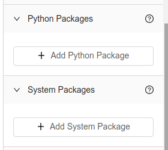

import Tabs from '@theme/Tabs';
import TabItem from '@theme/TabItem';

# External Package Dependencies

## Definition

For Python and Node Vessels, in addition to the language packages that are available in each, you may also install additional low level "system packages" for use by your code. With Platform's current setup, these must be [Debian Packages](https://www.debian.org/distrib/packages). These packages are installed using `apt-get` and get installed before [language package](external-package-dependencies.md). Typically, these only need to be included if they are a dependency for a language package you need to install.

:::note
Because Vessels are containerized, the System packages you install will only be available for that Vessel.
:::

## Screenshots

