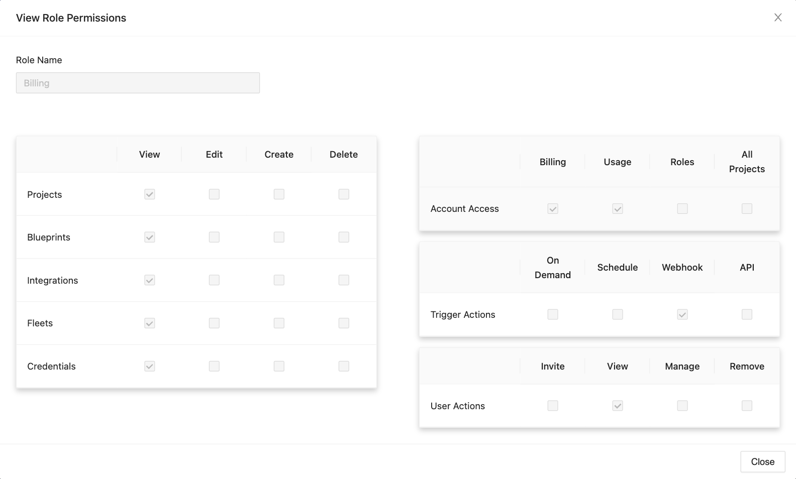

# Roles

## Definition

Roles are our new way of assigning and assessing permissions. While previously, all permissions were directly assigned to and associated with a user in an organization, now users will be assigned a role which have a defined set of permissions associated with the role itself. There are two types of Roles, **Predefined** and **Custom**, and there are four **Predefined** Roles:

1. Admin
2. Creator
3. Viewer
4. Billing

:::info

The ability to View, Create, Edit, and Delete Custom Roles is currently only available to customers who have **Roles** permission and are on the Business or Enterprise plan.

:::

## Screenshots

**Roles Table**

**Admin Role**

**Creator Role**

**Viewer Role**

**Billing Role** 

**Creating a Custom Role**

## Limitations

1. The ability to View, Create, Edit, and Delete Custom Roles are currently limited to customers who have **Roles** permission and are on the Business or Enterprise Plan.
2. Predefined Roles can only be viewed, not edited.
3. You cannot delete a role that is currently assigned to a user in your organization. You must first assign that user a new role.