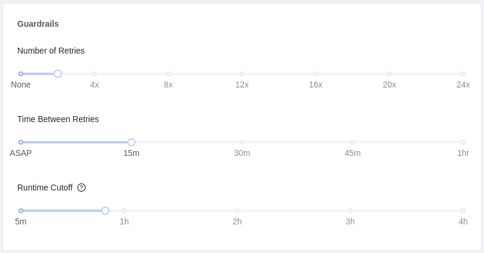

# Guardrails

## Definition

Guardrails help make sure that your Vessel runs successfully, no matter the situation. Guardrails are helpful for the following situations:
-  Avoiding a Vessel or Fleet from failing out due to smaller, unpredictable problems like timing or connection issues.
-  Continuously checking for a file to be delivered.
-  Polling an API until the expected status is seen.
-  Ensuring a Vessels runs for at most a specified amount of time.

Guardrails are made up of two options:

#### Number of Retries

Indicates the number of times that Vessels should be retried if they error out. By default, Vessels are set to "Never Retry" with the option to retry up to 24 times.

#### Time Between Retries

After a failure, the amount of time before Shipyard will try to run the Vessel again. By default, the platform will try "As Soon As Possible", but the delay can be set in increments of 5 minutes, with up to a 60 minute delay.

#### Runtime Cutoff

Indicates the maximum amount of time that a Vessel can run in a single attempt.
If runtime for a single Voyage exceeds this value, the Voyage will automatically
be terminated.
If retries remain, the Vessel will be retried.

## Screenshots

## Additional Notes

1. Retries only occur after the current Vessel has run into an error. You cannot retry a Vessel based on another condition or output of another Vessel.
2. Retries only happen using a time interval.
3. The option of retrying ASAP may actually result in a slight delay, due to the queuing and scheduling system of the application.
4. The timing interval between retries is required to be consistent - you can't have the retry interval grow, shrink, or change variably.
5. Only Vessels can have guardrails. This is to ensure rather than retrying an entire Fleet upon an error, you can retry a single component.
