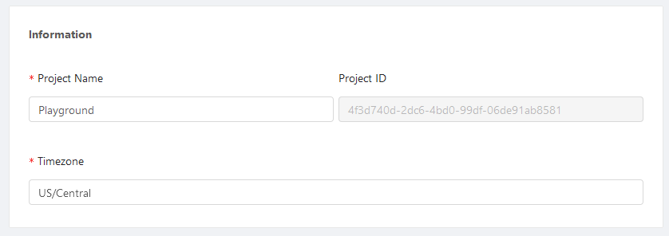

import Tabs from '@theme/Tabs';
import TabItem from '@theme/TabItem';

# Information

## Definition

The information section lives within the settings tab for almost every element in Shipyard. It usually contains IDs, names, and descriptors for the current element. For Projects, it also contains a field for timezone.

## Screenshots

<Tabs
groupId="elements"
defaultValue="project"
values={[
{label: 'Projects', value: 'project'},
{label: 'Vessels', value: 'vessel'},
{label: 'Blueprint', value: 'blueprint'},
{label: 'Fleets', value: 'fleet'},
]}>
<TabItem value="project">

</TabItem>
<TabItem value='vessel'>

</TabItem>
<TabItem value='blueprint'>

</TabItem>
<TabItem value='fleet'>

</TabItem>
</Tabs>
