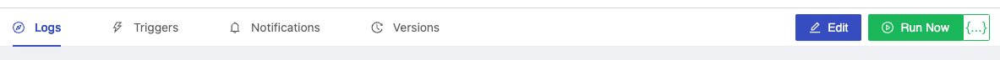
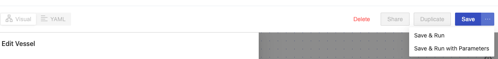
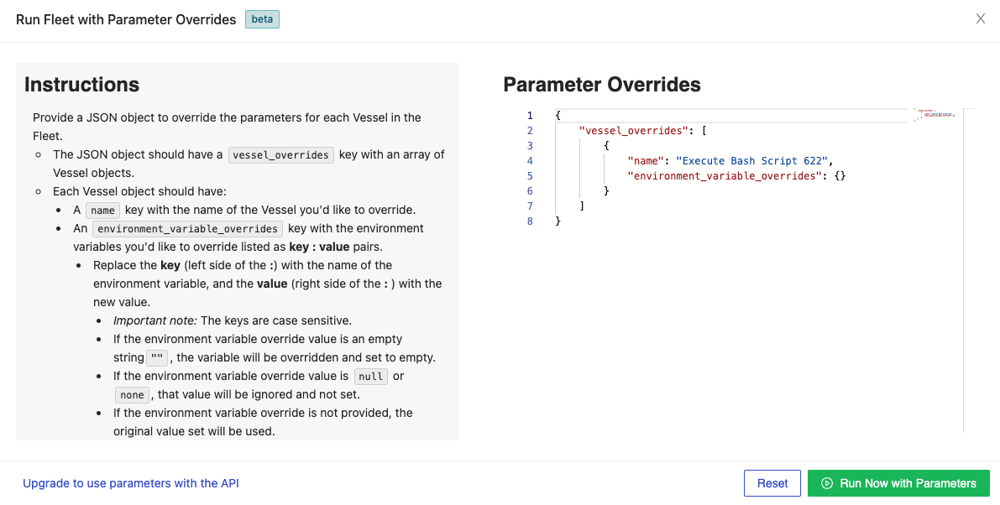

# On Demand Triggers

## Definition

On the top navigation pane for every Fleet, you are given either a **Run Now** button or a **Save** button in the top-right. Each button has an additional **{...}** button that corresponds with new functionality. Clicking this button will open up a drop down where you can specify if you want to **Run Now** or **Run Now with Parameters**. You can also just click the **Run Now** button if you're ready to run your fleet without any parameters. Once you are ready to run your fleet and the button has been pressed, the Fleet will be scheduled as a voyage immediately. You will then be re-directed to the newly created log. Live data and output will be shown without you needing to refresh.

:::info 

For more information on how to **Run Now with Parameters** and how to **Kick Off a Fleet Run in the Middle** see the **Learn More** links below.

:::

## Screenshots

**Running a Fleet from Logs page**

**Save and Run a Fleet from Editor**

**Run Now with Parameters**

## Additional Notes

1. Vessels or Fleets may not run instantaneously, as there is still time associated with entering a job queue, spinning up servers, and installing any [external package dependencies](../packages/external-package-dependencies.md).

## Learn More

- [How to Run a Fleet with Parameters](../../how-tos/fleets/run-with-params.md)
- [How to Kick off a Fleet in the Middle](../../how-tos/fleets/kick-off-a-fleet-in-the-middle.md)