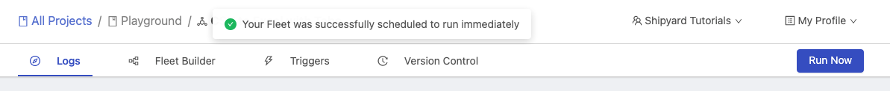

# On Demand Triggers

## Definition

On the top navigation pane for every Fleet, you are given a **Run Now** button in the top-right. Clicking this button will cause the Fleet to schedule a voyage immediately. You will then be re-directed to the newly created log. Live data and output will be shown without you needing to refresh.

## Screenshots

## Additional Notes

1. Vessels or Fleets may not run instantaneously, as there is still time associated with entering a job queue, spinning up servers, and installing any [external package dependencies](../packages/external-package-dependencies.md).
