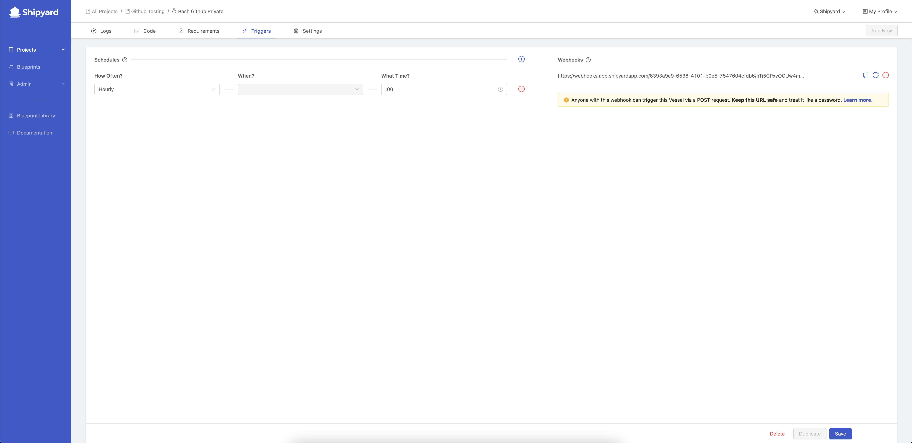

# Triggers

## Definition

Triggers are the logic that determines when a [Fleet](../fleets/fleets-overview.md) begins running. They are set on the Triggers tab and can only be set up after a Fleet has been created.

There are currently 4 types of supported triggers:

- [Schedule Triggers](schedule-triggers.md)
- [On Demand Triggers](on-demand-triggers.md)
- [Webhook Triggers](webhook-triggers.md)
- [API Triggers](api-triggers.md)

## Screenshots

