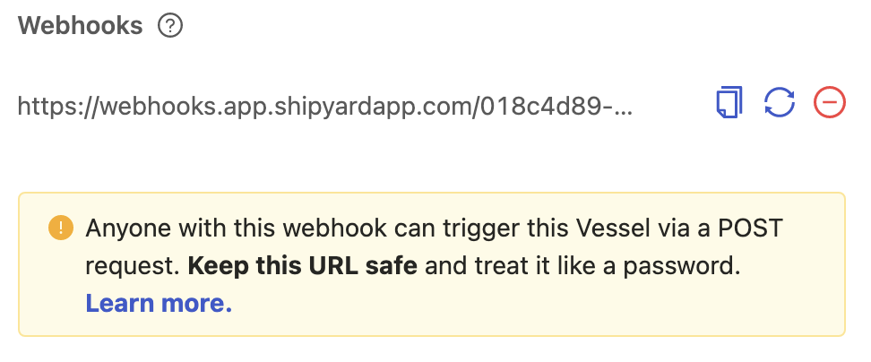

import Tabs from '@theme/Tabs';
import TabItem from '@theme/TabItem';

# Webhook Triggers

## Definition

On the Trigger tab for every Fleet, you are provided with a section for creating and managing Webhook Triggers.

Webhook Triggers enable you to programmatically execute a Fleet in Platform by running a POST request from any service. When you run the POST request, your Fleet will be scheduled to run immediately. You can also use webhooks to dynamically pass data to your Vessels at runtime.

Webhook triggers differ from [API triggers](api-triggers.md) in the following ways:
- Webhook triggers will work without authentication for anyone that has access to the URL.
- Webhooks can accept ANY data, while API triggers require a specific JSON payload.
- Data received by the webhook has to be interpreted by custom code that you write, so it can't be used for Blueprint Library inputs.

:::tip Pro Tip
Check out our [tutorial](../../tutorials/referencing-fleet-webhook-parameters.md) to better understand how to pass data using Webhook Parameters!
:::

When a webhook has been created, you will be given 3 options:

- Copy the entire webhook to your clipboard
- Replace the current webhook URL with a new webhook URL
- Remove the webhook URL from existence


## Webhook Status Codes

No matter which language or service you use to run the POST request, you will see the following status codes returned.

### 201 - Created Successfully

When your POST request returns a status code of 201, your entity has been successfully scheduled.

```javascript
{
   "request" : {
      "id" : "955939cc-2b90-4b8e-bf23-7375cd87822b"
   },
   "data" : {
      "fleet_id" : "cc3737df-06ee-431a-8f87-1e79f1eed6d6",
      "project_id" : "d1680f76-3b3c-420e-bbf3-9d62c6a2b450",
      "org_id" : "2d52c575-989e-4642-bc63-c63408ee3fd8",
      "fleet_run_id" : "ad4d4655-91fd-4499-9a1a-06d6e8a433d4"
   }
}
```

With this status code, you'll receive back IDs for the element you ran, alongside a unique request ID.

### 400 - Bad Requests

When your POST request returns a status code of 400, your request has failed. This is usually due to a webhook URL that is malformed or no longer exists. You'll see the following JSON response returned alongside this status code.

```javascript
{
   "request" : {
      "id" : "1af80dfc-e1b7-459f-9921-e5cb9e08b684"
   },
   "data" : null
}
```

## Screenshots




## Additional Notes

1. Each Fleet can only have one webhook associated to it.
2. Fleets may not run instantaneously, as there is still time associated with entering a job queue, spinning up servers, and installing any [external package dependencies](../packages/external-package-dependencies.md).

## Learn More
- [How to Execute a Webhook Trigger](../../how-tos/triggers/execute-webhook-trigger.md)
