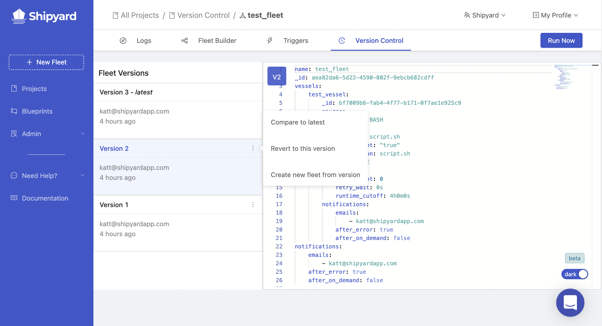
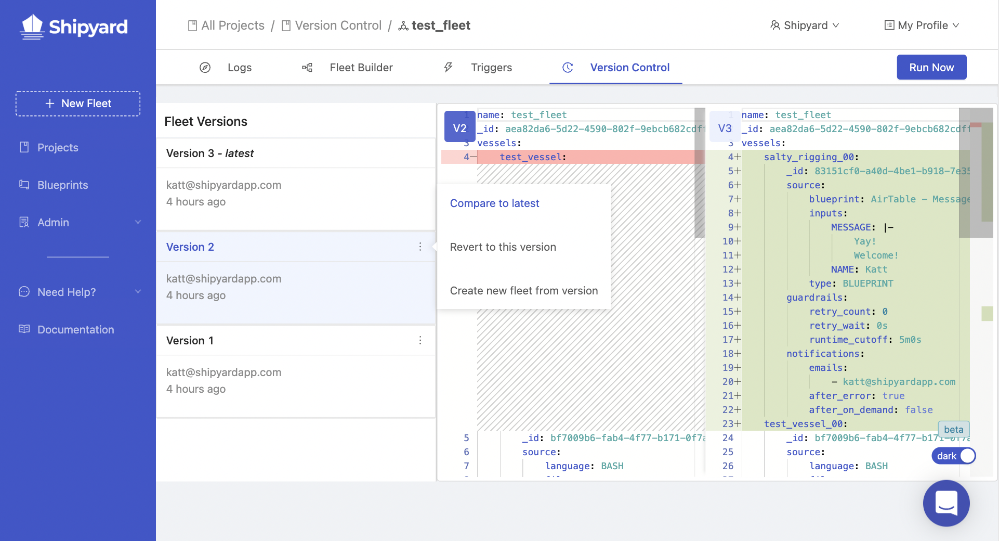

# Version Cards

## Definition

Each version is represented by a card. On a version card, you will see a version number, the email address of who created the version, and when it was created. When you click on a card, the [FAC](reference/fac.md) YAML for that version of the Fleet will appear in the code window on the right. In addition, each card has a menu of actions that can be taken on each version. 

## Card Actions
- **Compare to latest**: This will compare the selected version to the latest version. In the code window, you will see the selected version on the left and the latest on the right. Any differences between the two will be highlighted. Red highlighting means something was removed and green means that something was added.

:::note
The YAML-based definition of a Shipyard Fleet is generated from the Fleet's underlying JSON rather than being stored as a file. For this reason, Vessels within the Fleet's YAML can sometimes display in a different order and appear highlighted even if they were not edited.
:::

- **Revert to this version**: This will revert the Fleet's configuration to the selected version. A new version will be generated and will appear at the top of the list as the **latest** version. This will be the version the Fleet Builder will display if you navigate to that tab.
- **Create a new fleet from version**: This will use the selected version to create a new Fleet. You will be redirected to the Fleet Builder in the newly created Fleet. This will not make any changes to the current Fleet.

## Screenshots

