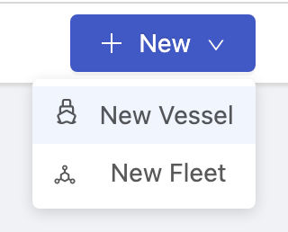
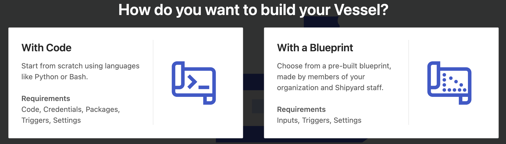
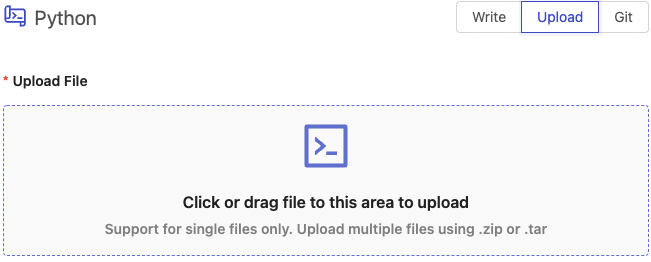
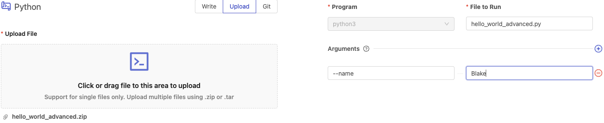
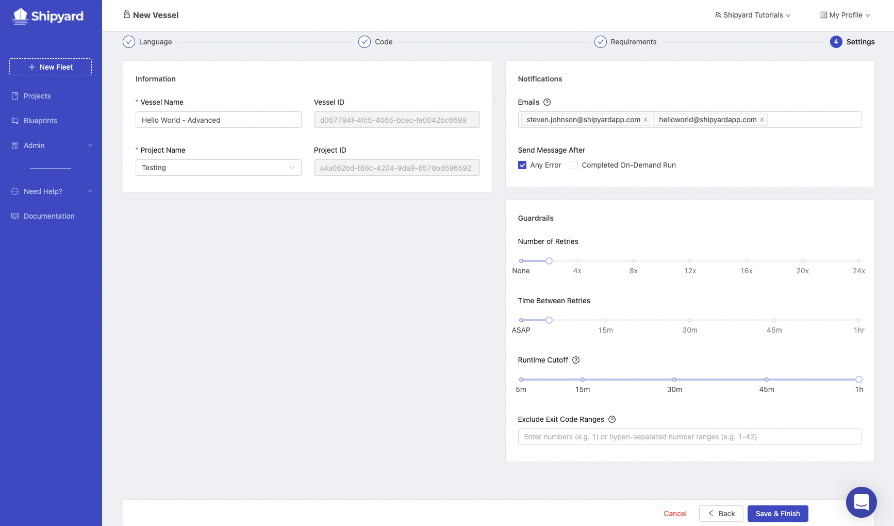
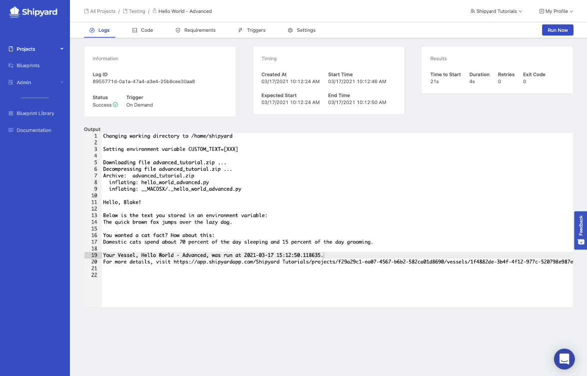
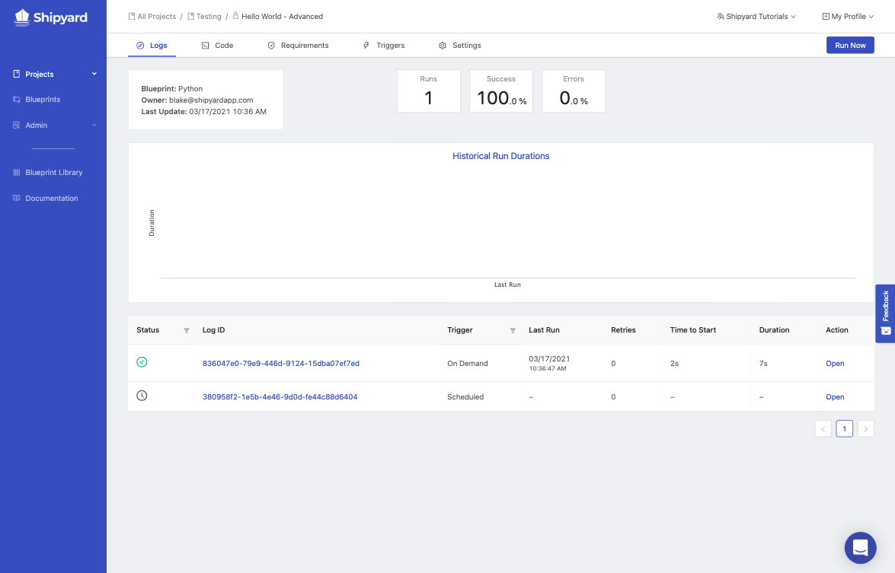

import Tabs from '@theme/Tabs';
import TabItem from '@theme/TabItem';

# Building a More Advanced Code Vessel

## Overview

In this tutorial, you'll walk through the steps required to set up a more advanced Vessel that prints `Hello, World`. This contains many of the same steps as our [original Hello World tutorial](../getting-started/first-vessel-with-code.md), with added steps to teach more features of the platform. This tutorial is only in Python \(for now\).

By the end of the tutorial, you'll be able to:

- Set up a [Vessel](../reference/vessels.md) with Code
- [Upload a script](../reference/code/upload-code.md) to Shipyard.
- Pass [arguments](../reference/arguments.md) to your solution.
- Pass [environment variables](../reference/environment-variables/environment-variables-overview.md) to your solution.
- Install [package dependencies](../reference/packages/external-package-dependencies.md) for your solution.
- Reference [platform environment variables](../reference/environment-variables/shipyard-environment-variables.md).
- Check [Logs](../reference/logs/logs-overview.md) to verify that a Vessel ran successfully.

## Setup

:::caution
For the sake of the this tutorial, we suggest starting off by building a Vessel inside either the *Playground* Project or a *Testing* Project. You can follow [this tutorial](../getting-started/first-project.md) to set that up.
:::

First, [download this code](https://drive.google.com/file/d/1e6xQOo2M2jnPJdPOmAPOKwW4aLlgV-GF/view?usp=sharing), named `hello_world_advanced.zip` to your computer without making any changes.

Feel free to peruse this script beforehand so you understand everything that it's doing. The script is accomplishing four main things:

1. Prints `Hello` and `{your_name}` by referencing the command argument of `--name`.
2. Prints custom text that is stored as an environment variable called `CUSTOM_TEXT`.
3. Connects to an [external API](https://alexwohlbruck.github.io/cat-facts/), using the requests library, to find and print a random Cat Fact.
4. Prints information about the current run, including a timestamp and a link to the current log by using [Platform Environment Variables](../reference/environment-variables/shipyard-environment-variables.md).

## Steps

1. Using the sidebar, click on **Projects** to navigate to the All Projects page.
2. Click on either the *Playground* or *Testing* Project.
3. Hover over the **+ New** button in the top-right corner of the screen and click **New Vessel**.

4. A modal will pop up asking you how you would like to use to build your Vessel. On the left side of the modal, you'll see an option for a **With Code**. Click this option.

:::tip success
You've successfully started the setup flow for building a Vessel with code.
:::

We'll now walk through the process of filling out Vessel Wizard to create our Advanced "Hello World" Vessel.

### Step 1 - Select a Language

<Tabs
groupId="languages"
defaultValue="python"
values={[
{label: 'Python', value: 'python'},
]}>
<TabItem value="python">

Click on the **Python** option. You'll be immediately redirected to the next step.
</TabItem>
</Tabs>

### Step 2 - Provide your Code

<Tabs
groupId="languages"
defaultValue="python"
values={[
{label: 'Python', value: 'python'},
]}>
<TabItem value="python">

1. On the left side of the screen, select the **Upload** option. 
2. Click the upload section icon and select the `hello_world_advanced.zip` file from your computer.
3. On the right-hand side of the screen, there is a field entitled **File to Run**. Because the .zip contains a single python file named `hello_world_advanced.py`, you'll need to use that name.
4. Click the **+** icon next to Arguments to create a new [command argument](../reference/arguments.md).
5. In the **flag** field on the left-hand side, type `--name`.
6. In the **value** field on the right-hand side of the new argument, type your name.

</TabItem>
</Tabs>

Once you're done, click the **Next Step** button at the bottom of the screen.

### **Step 3 - Requirements**

#### Environment Variables

1. Click the **+** icon next to Environment Variables to add a new variable.
2. In the **Name** field on the left-hand side, type `CUSTOM_TEXT`.
3. In the **Value** field, type `The quick brown fox jumps over the lazy dog.`. This text will be printed at the end.

:::note
The value field will always show `•••••••` as you type. This is because Environment Variables are commonly used for passwords and secrets. You can always reveal what you've written by clicking the eye icon.
:::

#### Packages

<Tabs
groupId="languages"
defaultValue="python"
values={[
{label: 'Python', value: 'python'},
]}>
<TabItem value="python">

1. Click the **+** icon next to Packages to add a new package.
2. In the **Package Name** field on the left-hand side, type `requests`.
3. In the **Version** field on the right-hand side, type `==2.22.0`

:::caution
The Version must match the formatting for [requirements files](https://www.python.org/dev/peps/pep-0440/#version-specifiers).
:::
</TabItem>
</Tabs>

Once you're done, go ahead and click the **Next Step** button at the bottom of the screen.

### Step 4 - Settings

1. Under the Information section, give your Vessel the name of `Hello World - Advanced`.
2. Under the notifications section, make sure that your email is listed. It should be added by default.
3. Add an additional notification email of `helloworld@shipyardapp.com`. You'll notice that you can add any user or alias to the notification list, whether or not they have access to your organization.
4. Under the Guardrails section, set the **Number of Retries** to 2x and the **Time Between Retries** to 5m.
5. Click the **Save & Finish** button at the bottom of the screen.

:::info
We changed the default Guardrails because of the potential for the Cat Facts API to have connection issues.
:::

### Step 5 - Running the Vessel On-Demand

1. Click **Run Now** at the top right of the page. This will schedule your Vessel to run immediately and redirect you to the [Vessel Log](../reference/logs/vessel-logs.md) page.

You should see the following page that shows you all of the details about the specific Log.

:::note
If the Vessel has a Status of **Scheduled** or  **Running** you may see sections of this page that are incomplete.

Wait a few seconds for your Vessel to run. The page will automatically refresh.
:::

In the output, you'll see a total of 6 things.

1. Shipyard creates a working directory under `/home/shipyard/`
2. Shipyard downloads the file you created under the Code section, decompresses it, and begins to run `hello_world_advanced.py`
3. Shipyard prints the text `Hello, {your name}!`
4. Shipyard prints out the custom text you wrote, stored under the environment variable `CUSTOM_TEXT`.
5. Shipyard prints out a cat fact.
6. Shipyard prints out your Vessel Name, the time it ran, and a link to that specific run.

### Step 6 - Viewing all Logs

1. Switch to the **Logs** tab at the top. This will redirect you back to all of the Logs for the Vessel you just made.
2. You should see a log that has been triggered *On Demand* from you clicking the **Run Now** button.

:::tip Success
You've successfully created and verified an Advanced Hello World Vessel.
:::
