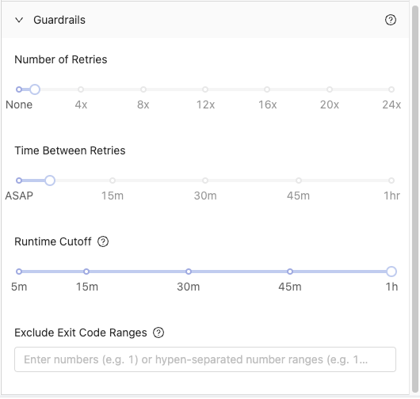

# Using Guardrails to Make Check Status Vessels Run More Efficiently 

## Overview

In this tutorial, we will walk through the steps to setup [guardrails](../reference/guardrails.md) in a check status Vessel to allow downstream processes to run more quickly.

By the end of the tutorial, you'll be able to:

- Set up a [Vessel](../reference/vessels.md) using a check status Blueprint.
- Set up [guardrails](../reference/guardrails.md) to make the Vessel run efficiently.

## Setup

:::note
This tutorial will use the Check Sync Status Blueprint from Fivetran. The steps in this tutorial will work with any Integration that has a check status Blueprint such as dbt Cloud or Tableau.
:::

1. Create a new Fleet.
2. Add a Vessel to the new Fleet that uses the Fivetran - Execute Sync Blueprint. 
3. Name the Vessel: Execute Fivetran Sync.
4. Enter your API Key, API Secret, and Connector ID under Inputs. 

Now that we have a Vessel that will execute a sync in Fivetran, we can setup a Vessel that will check the status of that sync. 

## Steps

1. Create a new Vessel using the Fivetran - Check Sync Status Blueprint. 
2. Name the Vessel: Check Fivetran Sync Status
3. Enter your API Key and API Secret under Inputs. 

:::note
When connecting a check status Blueprint to an execute task Blueprint, you do not have to enter in the id of your run. We will grab that value from the upstream Vessel.
:::

4. Expand the Guardrails menu

5. Under `Number of Retries`, select **24x**.
6. Under `Time Between Retries`, select **ASAP**.

:::caution
The guardrail setup above will not work for processes that run for longer than an hour. For longer runs, you will need to change the Time Between Retries to 5, 10, or 15 minutes. 
:::

7. Connect the Execute Fivetran Sync Vessel to the Check Fivetran Sync Status Vessel.

:::tip Success
You've successfully set up guardrails to make your check status Vessels run more efficiently.
:::