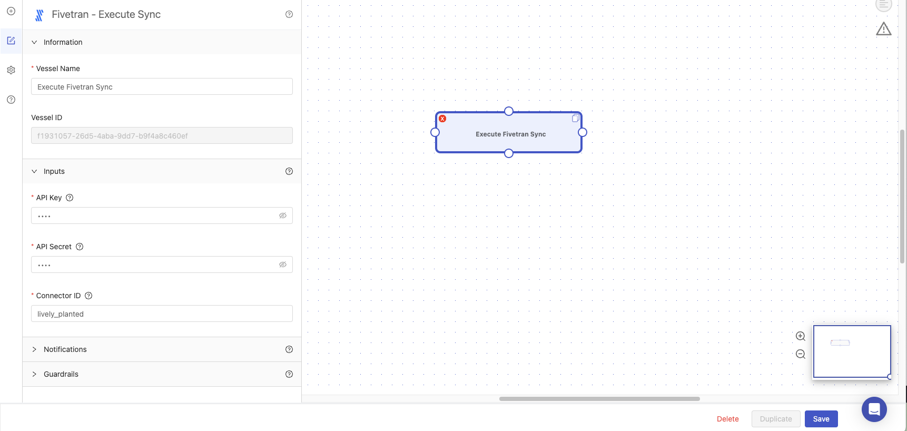
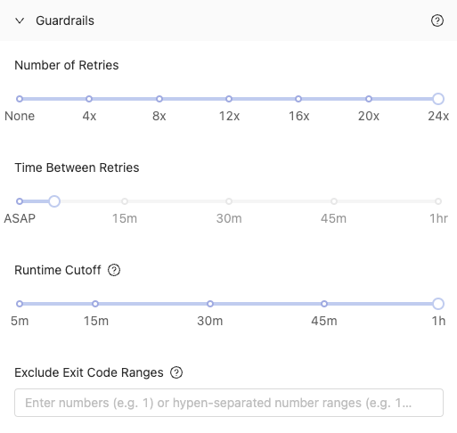
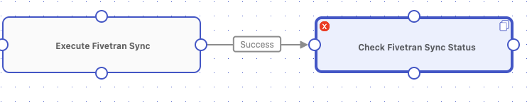

# Efficiently Check Status with Guardrails

## Overview
In this tutorial, we will walk through the steps to set up [guardrails](../reference/guardrails.md) for a Check Status Vessel to ensure that downstream processes don't run until an upstream job finishes.

By the end of the tutorial, you'll be able to:

- Set up a [Vessel](../reference/vessels.md) using a Check Status Blueprint.
- Set up [guardrails](../reference/guardrails.md) to make the Vessel run efficiently.

### Background
Platform's Check Status Blueprints are designed to quickly ping the desired vendor, asking "What's the status of job X?". If job X is incomplete, the Vessel will fail - by design. Vessels built with these Blueprints were designed to be used together with [guardrails](../reference/guardrails.md), which automatically retry a Vessel after seeing a failure.

With guardrails in place, Platform will retry after a specified period of time and once again ask the vendor "What's the status of job X?". Once the vendor returns with any answer other than *incomplete*
- If the answer is *success*, the Vessel will finish successfully.
- If the answer is *errored*, *canceled*, or any other negative response, a unique exit code will be generated and the Vessel will error. If this exit code is found in the list of [exclusions](https://www.shipyardapp.com/docs/reference/guardrails/#exclude-exit-code-ranges) the Vessel will no longer be retried.

With this strategy, Vessels built with the Check Status Blueprint will check the status the minimum number of times until a final answer is received. Since the time between retries is not part of [billable runtime](https://www.shipyardapp.com/docs/faqs/#how-do-you-calculate-billable-runtime) this is both a cost-effective and time-efficient strategy.

Without this strategy there are two outcomes:
- The Check Status Blueprint ends prematurely with an error, before the job has completed on the vendor's service.
- Your Fleet runs without regard to a previously kicked off job's status.

## Setup

:::note
This tutorial will use the Check Sync Status Blueprint from Fivetran. The steps in this tutorial will work with any Integration that has a **Check Status** Blueprint such as dbt Cloud or Tableau.
:::

1. Create a new Fleet.
2. Add a Vessel to the new Fleet that uses the Fivetran - Execute Sync Blueprint. 
3. Name the Vessel: Execute Fivetran Sync.
4. Enter your API Key, API Secret, and Connector ID under Inputs. 

Now that we have a Vessel that will execute a sync in Fivetran, we can setup a Vessel that will check the status of that sync. 

## Steps

1. Create a new Vessel using the Fivetran - Check Sync Status Blueprint. 
2. Name the Vessel: Check Fivetran Sync Status
3. Enter your API Key and API Secret under Inputs. 

:::note
When connecting a check status Blueprint to an execute task Blueprint, you do not have to enter in the id of your run. We will grab that value from the upstream Vessel.
:::

4. Expand the Guardrails menu
5. Under `Number of Retries`, select **24x**.
6. Under `Time Between Retries`, select **5m**.

:::caution
If there are values under the **Exclude Exit Code Ranges** option, leave these alone! These tell Platform to not retry if a final status of an error is found.
:::

:::info Pro Tip
The guardrail setup above will wait for up to 2 hours (5m*24 retries) for something to complete. For longer runs, you may need to increase the **Time Between Retries**. For shorter runs, you can adjust the **Time Between Retries** to be **ASAP** (~30s).
:::

7. Connect the Execute Fivetran Sync Vessel to the Check Fivetran Sync Status Vessel.

:::tip Success
You've successfully set up guardrails to make your check status Vessels run more efficiently.
:::
